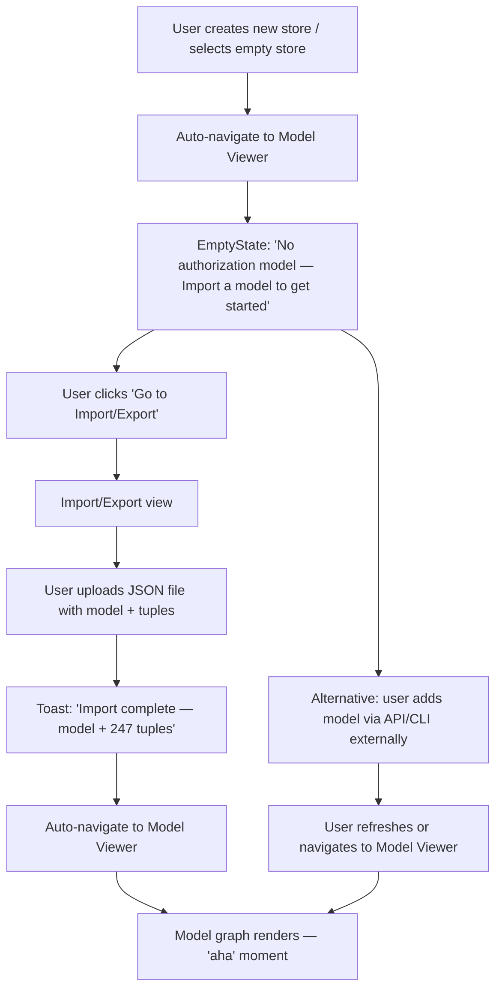
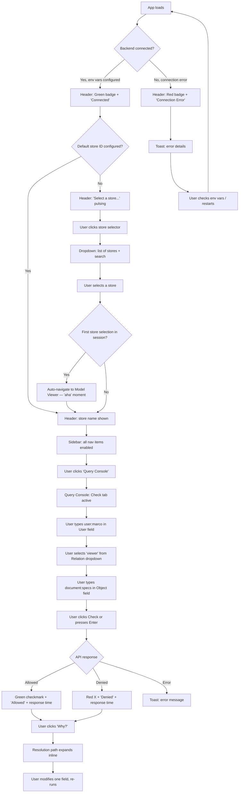
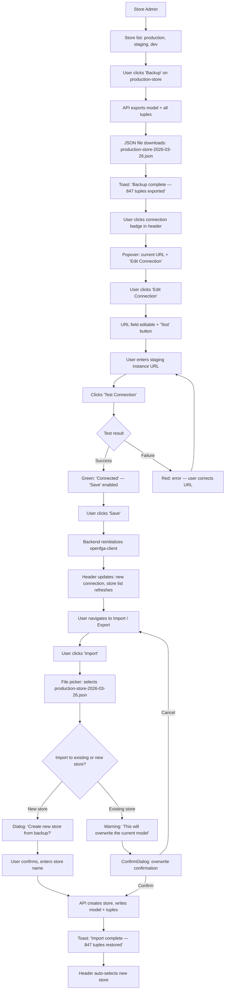
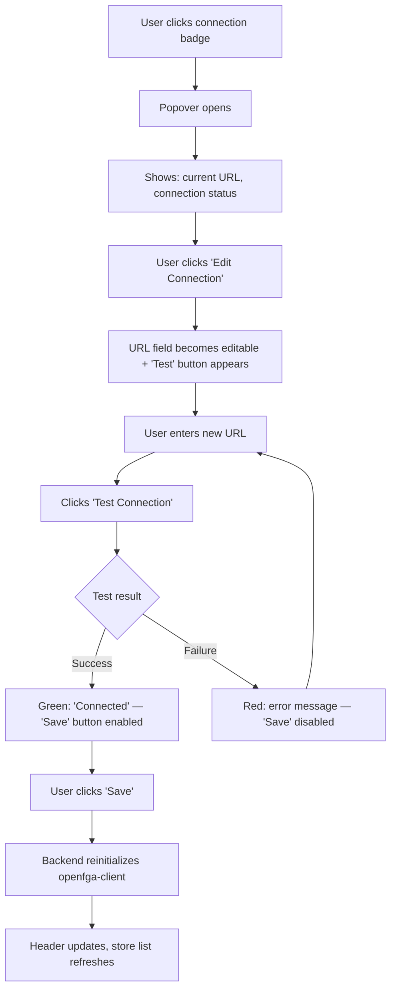

# UX Design Specification openfga-viewer

**Author:** monte
**Date:** 2026-03-26

---

<!-- UX design content will be appended sequentially through collaborative workflow steps -->

## Executive Summary

### Project Vision

OpenFGA Viewer is a standalone web application that fills a critical gap in the OpenFGA ecosystem: a professional-grade tool for managing, visualizing, and querying authorization models on real deployed instances. By routing all communication through a backend proxy, it eliminates the CORS limitations of the official Playground and provides a secure, controllable layer for teams working with OpenFGA in production environments. The tool is designed to be immediately useful — connect, see your model, query permissions — with zero learning curve for core tasks.

### Target Users

| User | Role | Technical Level | Primary Goal | Key Need |
|---|---|---|---|---|
| Backend Developer | Day-to-day authorization work | High | Understand and debug permissions | Visual clarity, fast queries, no CLI friction |
| Platform Engineer | Multi-instance management | High | Administer stores across environments | Backup/restore, store CRUD, instance switching |
| Trainer | Live demos and workshops | High | Teach authorization concepts interactively | Import/export scenarios, visual model exploration |
| Project Manager | Policy verification | Low | Prove the model matches business rules | Readable graphs, green/red feedback, screenshot-friendly |

All users share a desktop environment (1280px+) and work in focused sessions — this is a task tool, not an ambient dashboard.

### Key Design Challenges

1. **Two-graph mental model** — The model graph (abstract: types and relations) and the relationship graph (concrete: entities and tuples) serve different purposes but use the same rendering technology (Vue Flow). The UX must make the distinction immediate and unambiguous through naming, visual treatment, and navigation placement.

2. **Multi-input query console** — Four query types (Check, List Objects, List Users, Expand) have different input schemas and radically different output formats (boolean, object list, user list, tree). The interface must guide users to the right query without overwhelming them.

3. **Pervasive store context dependency** — Nearly every view requires a connected instance and selected store. The UX must handle missing context gracefully, prevent dead-end states, and make store switching low-friction.

4. **Mixed technical literacy** — The same views must serve developers who think in `user:alice` / `relation:viewer` and non-technical stakeholders who think in business rules. Visual feedback (green/red, graph layout) must communicate without requiring domain syntax knowledge.

### Design Opportunities

1. **Visual debugging as core differentiator** — The combination of relationship graph navigation + green/red permission feedback can make OpenFGA Viewer the fastest way to debug authorization, turning a 20-minute CLI investigation into a 3-minute visual workflow.

2. **Guided first-run experience** — The "no store selected" state is an opportunity to onboard users in 3 steps (connect → select store → see your model), turning a potential dead-end into a welcoming entry point.

3. **Graph-to-query contextual linking** — Clicking entities or relations in graphs can pre-fill the query console, creating a seamless inspect-then-verify flow that no CLI can match.

## Core User Experience

### Defining Experience

The core interaction loop of OpenFGA Viewer is **query → visualize → understand**. Users connect to an OpenFGA instance and immediately begin verifying permissions, exploring models, and debugging access issues. The most frequent action is running permission queries (Check, List Objects, List Users, Expand), but the defining experience is the moment a complex authorization model becomes visually clear — through graphs, color-coded results, and contextual navigation.

The critical action to get right is the **first connection and store selection**: if users aren't oriented and productive within 30 seconds of opening the tool, the experience fails before any feature can prove its value.

### Platform Strategy

- **Desktop web application** (1280px+), mouse and keyboard primary input
- **Co-exists with developer workflows** — the tool sits alongside terminals, IDEs, and documentation. It must not demand full-screen attention.
- **Copy/paste as a first-class interaction** — users paste user IDs from logs, object IDs from code, and relation names from documentation directly into query fields
- **No offline support required** — the tool is meaningless without a live OpenFGA connection
- **Keyboard acceleration for power users** — repeated query workflows (change one field, re-run) should be fast without reaching for the mouse

### Effortless Interactions

These interactions must feel zero-friction:

| Interaction | Why It Must Be Effortless |
|---|---|
| Connecting to an instance | Pre-configured via env vars; on launch, users see their stores immediately — no setup wizard |
| Switching views | Store context, last query, and navigation state persist across view changes — no re-entering data |
| Reading a permission result | Green = allowed, red = denied. Instant, unambiguous, no JSON parsing required |
| Understanding a permission result | Check shows green/red, then "Why?" expands the resolution path inline — no separate query, no view switch |
| Graph → Query flow | Clicking an entity in a graph pre-fills the query console — inspect then verify in one motion |
| Adding/deleting tuples | Inline forms with smart defaults (pre-fill type from current view context), no modal dialogs for single operations |

### Critical Success Moments

1. **First green/red check result** — The "aha" moment. A developer runs their first Check query and sees a clear green checkmark or red X within 1 second. This is when the tool proves its value over curl + JSON.

2. **Model graph reveals structure** — A wall of JSON authorization model becomes an interactive visual graph. Types as nodes, relations as edges. Users finally *see* their authorization architecture.

3. **Finding the missing link** — While debugging a permission issue, the relationship graph reveals a missing tuple that raw data couldn't surface. The visual representation makes the gap obvious.

4. **Non-technical stakeholder reads the graph** — A project manager looks at the model graph and says "yes, that matches our access policy" without needing a developer to translate. The tool speaks both technical and business language through its visual design.

5. **"Why?" reveals the permission chain** — After seeing green or red, the user clicks "Why?" and instantly sees the resolution path: `user:marco → member of team:backend → viewer on document:specs`. For denied results, the chain shows where it breaks. No more guessing — the tool explains its answers.

### Experience Principles

1. **Show, don't tell** — Every piece of authorization data has a visual representation. If users need to read raw JSON to understand something, the UX has failed. Graphs, color coding, and structured layouts replace data dumps.

2. **Connect and go** — Zero setup friction. Pre-configured connection works on launch; first meaningful interaction within 30 seconds. The tool assumes you know what you're here to do and gets out of the way.

3. **Context flows, never resets** — Store selection, query inputs, and navigation state persist across view switches. The tool remembers what you were doing. Switching from Tuple Manager to Query Console doesn't lose your filters or selections.

4. **Answers, not data — and explain why** — Green/red, not `{"allowed": true}`. But also: *why* green, *why* red. Every Check result offers an inline "Why?" expansion showing the resolution path — which tuples and relations led to the decision. For denials, show where the chain breaks. Phase 2 can elevate this to graph-highlighted paths, but MVP delivers the textual explanation inline.

## Desired Emotional Response

### Primary Emotional Goals

**Confident control** — Users should feel like they understand their authorization system and can act on it safely. OpenFGA Viewer turns opaque infrastructure into something visible, verifiable, and manageable. The tool earns trust by being transparent (live queries, no caching, clear feedback) and builds confidence through visual clarity.

### Emotional Journey Mapping

| Stage | Desired Feeling | What Triggers It |
|---|---|---|
| First open | Oriented, not overwhelmed | Clean layout, connection status visible, clear starting point |
| First connection | Relief + trust | "Test Connection" → green badge. It works. No CORS errors. |
| Exploring model | Clarity, "now I get it" | JSON → visual graph. The model makes sense for the first time |
| Running a query | Confidence | Green/red is instant and unambiguous. "Why?" explains the logic |
| Debugging a permission | Detective satisfaction | The graph reveals the missing link. Problem solved in minutes, not hours |
| Managing stores | Safety, control | "I have a backup. I can recover. I'm not operating blind." |
| Something goes wrong | Informed, not panicked | Clear error messages with context — what failed and why, not cryptic 500s |
| Returning to the tool | Familiarity, no re-learning | Same layout, state preserved, muscle memory works |

**Future vision:** Test management integration — define expected permission results as test suites, run them against live instances, detect regressions. The emotional goal: **certainty** ("my authorization model is correct and I can prove it continuously, not just ad-hoc").

### Micro-Emotions

| Desired State | Over | Why It Matters |
|---|---|---|
| Confidence | Confusion | Every interaction reinforces "I know what's happening." Ambiguous states are the enemy |
| Trust | Skepticism | When the tool says "allowed" or "denied," it reflects real OpenFGA state. No caching, no stale data |
| Accomplishment | Frustration | Tasks complete cleanly with visible confirmation. No silent successes |

**Emotions to actively prevent:**
- **Anxiety** ("did I just break production?") → confirmation dialogs on all destructive actions (delete store, batch delete tuples)
- **Disorientation** ("where am I? which store?") → persistent header with connection status + active store name on every view
- **Doubt** ("is this result current?") → always query live, never cache permission results, show response timestamps

### Design Implications

| Emotional Goal | UX Design Approach |
|---|---|
| Confident control | Persistent context (header badge, store name), explicit confirmation on destructive actions, clear state indicators |
| Clarity / "now I get it" | Visual graphs with meaningful layout, color-coded types, labeled edges — no raw JSON as primary display |
| Trust | Live queries only (no caching), error messages with full context, "Why?" expansion on Check results |
| Detective satisfaction | Relationship graph that makes missing links visible, graph-to-query flow for fast verification |
| Safety | Backup before changes, export/import workflows, undo-friendly patterns (confirm before delete) |
| Familiarity on return | Consistent layout across all views, persistent navigation state, no UI surprises between sessions |

> **Future-proofing note:** MVP query console inputs should be designed with reusability in mind — the same Check/ListObjects input format will eventually serve as test case definitions in the test management feature.

### Emotional Design Principles

1. **Transparency builds trust** — Show what's happening. Live queries, visible connection state, response context. Never hide the system state from the user.

2. **Confirmation prevents anxiety** — Destructive actions always require explicit confirmation. Non-destructive actions give visible feedback (toast, badge update, inline success). No action should leave the user wondering "did that work?"

3. **Clarity over cleverness** — Choose the most readable representation, not the most compact. A visual graph with labeled edges beats a tree of IDs. Green/red with "Why?" beats a JSON response body. The tool's job is to make authorization understandable.

4. **Progressive disclosure of complexity** — Start with the answer (green/red), offer the explanation ("Why?"), enable deep investigation (relationship graph). Each layer is opt-in, never forced.

## UX Pattern Analysis & Inspiration

### Inspiring Products Analysis

**1. Postman** — The gold standard for API developer tools
- **What it does well:** Tabbed request interface with clear input → output flow. You fill fields, hit Send, see the result immediately. History persists. Collections organize work.
- **Relevant to us:** Our Query Console follows the same pattern — fill user/relation/object, hit Check, see green/red. Postman's input → result → history flow is directly transferable.
- **Key UX lesson:** The response area is always visible below the input. No page navigation to see results. Input and output live together.

**2. Grafana** — Complex data made visual and explorable
- **What it does well:** Dense information presented through progressive disclosure — dashboard overview → click panel → drill into detail. Sidebar navigation with persistent context (time range, data source). Dark theme that makes colored data pop.
- **Relevant to us:** Our header context (connection + store) mirrors Grafana's data source selector. The graph views need the same "overview → click → detail" pattern.
- **Key UX lesson:** Context selectors (data source / time range) are always visible in the header, never buried in settings. Every view respects the current context.

**3. Neo4j Browser** — Graph data exploration done right
- **What it does well:** Type a query, see a graph. Nodes are colored by label, draggable, clickable for detail. The graph is the primary interface, not a secondary visualization.
- **Relevant to us:** Our Relationship Graph view is essentially this — entities as nodes, relations as edges, colored by type. Neo4j's "click node → see properties" maps directly to our GraphNodeDetail panel.
- **Key UX lesson:** The graph canvas takes maximum screen space. Controls are minimal overlays, not sidebars. Let the visualization breathe.

**4. pgAdmin / DBeaver** — Data table management for technical users
- **What it does well:** Filterable data tables with inline editing, pagination for large datasets, tree-based navigation (server → database → schema → table).
- **Relevant to us:** Our Tuple Manager is a data table with filters, add/delete, pagination — same pattern. The store → model hierarchy mirrors the database tree navigation.
- **Key UX lesson:** Batch operations (select rows → delete) with clear selection indicators. Filters that are visible and active, not hidden behind a button.

**5. Figma** — Inspector panel pattern for contextual detail
- **What it does well:** Click an element on the canvas, a side panel slides in showing properties and actions — canvas stays visible, no modal interruption, no page navigation. Detail and context coexist.
- **Relevant to us:** Both graph views (Model Graph and Relationship Graph) need this pattern. Click a type node → side panel shows relations, metadata, connected types. Click an entity → side panel shows relationships and quick actions ("Query this entity").
- **Key UX lesson:** Detail panels are companions to the canvas, not replacements. The user never loses spatial context while inspecting a node.

**6. VS Code / Monaco Editor** — Code viewing as user expectation
- **What it does well:** Syntax highlighting, line numbers, monospace layout, inline diagnostics, hover tooltips. Sets the bar for how developers expect code-like content to look and feel.
- **Relevant to us:** The DSL view in Model Viewer should feel like a code viewer, not a `<pre>` block. Shiki for syntax highlighting + line numbers + monospace layout gets 80% of the Monaco feel at 1% of the bundle cost.
- **Key UX lesson:** Developers have ingrained expectations for code display. Meeting those expectations (even read-only) builds immediate trust and familiarity.

### Transferable UX Patterns

| Pattern | Source | Application in OpenFGA Viewer |
|---|---|---|
| Input → Result on same page | Postman | Query Console: input fields above, result below, no navigation |
| Header context bar | Grafana | Persistent header: connection status + active store name on every view |
| Full-canvas graph + click-for-detail | Neo4j Browser | Both graph views: maximize canvas, minimal overlay controls |
| Filterable data table + batch ops | pgAdmin/DBeaver | Tuple Manager: TanStack Table with visible filters, batch select+delete |
| Side inspector panel | Figma | Graph views: click node → side panel with detail + quick actions, canvas stays visible |
| Code viewer aesthetics | VS Code/Monaco | DSL view: Shiki highlighting + line numbers + monospace. Looks like code, not text |
| Universal "Why?" affordance | Original (team insight) | Reusable "Why?" button component. MVP: active on Check results. Future: all query types and graph edges |

### Anti-Patterns to Avoid

| Anti-Pattern | Source | Why It Hurts | Our Counter |
|---|---|---|---|
| Modal-heavy interactions | OpenFGA Playground | Modals break flow for simple actions | Inline forms, expandable panels, side inspector |
| Information overload | Kubernetes Dashboard | Showing every field on every resource overwhelms | Progressive disclosure: answer first, detail on demand |
| State reset on navigation | Many developer tools | Switching tabs loses query inputs, filters, selections | "Context flows, never resets" principle |
| Graph without text fallback | Some graph-only tools | Unusable without mouse, inaccessible | Keyboard navigation + text alternatives alongside graphs |
| Data without context | Raw API tools | Results without explanation require expertise to interpret | "Why?" pattern: every result can be explained |
| Plain text code display | Legacy tools | `<pre>` blocks feel unprofessional, erode trust | Shiki + line numbers + monospace = code viewer feel |

### Design Inspiration Strategy

**Adopt directly:**
- Postman's input → result layout for Query Console
- Grafana's persistent header context pattern
- Neo4j's full-canvas graph with click-for-detail
- pgAdmin's filterable table with batch operations
- Figma's side inspector panel for graph node detail

**Adapt to our context:**
- VS Code's code viewer aesthetics → lightweight Shiki implementation (read-only, no editing in MVP)
- Neo4j's single graph → two distinct graph contexts (model vs. relationships) with different visual treatments
- Postman's collections/history → future phase, not MVP

**Innovate (our differentiator):**
- Universal "Why?" pattern — a reusable component that explains any result. MVP: Check query resolution path. Future: extend to List Objects, List Users, and graph edges. No inspiration source does this consistently; it becomes our design language.

**Avoid:**
- Modal dialogs for single-item operations
- Hiding filters behind buttons or menus
- Resetting view state on navigation
- Showing raw JSON as primary data representation

## Design System Foundation

### Design System Choice

**Tailwind CSS v4.2 as design foundation** with custom components and headless libraries for complex interactions. No pre-built component library (no Vuetify, PrimeVue, Ant Design Vue).

| Layer | Technology | Role |
|---|---|---|
| Styling foundation | Tailwind CSS v4.2 | Utility-first CSS, `@theme` design tokens, responsive utilities |
| Icons | Lucide (`lucide-vue-next`) | Tree-shakeable, Vue-native icon library |
| Data tables | TanStack Table v8 (headless) | Pagination, filtering, selection, sorting — styled with Tailwind |
| Graph rendering | Vue Flow + dagre | Both model and relationship graphs — styled with Tailwind |
| Code display | Shiki | DSL syntax highlighting — line numbers + monospace layout |
| Notifications | Custom toast composable | Lightweight, no external library |
| All other components | Custom + Tailwind | Buttons, inputs, badges, tabs, cards, dialogs — ~11 base components |

### Rationale for Selection

1. **Solo developer velocity** — Tailwind utilities enable fast UI iteration without writing CSS files or fighting component library opinions
2. **Developer tool aesthetic** — Pre-built libraries (Material, Ant) produce a "consumer app" look. Tailwind gives full control over a professional, tool-like aesthetic consistent with inspiration sources (Grafana, Postman, VS Code)
3. **Headless where it matters** — TanStack Table and Vue Flow handle complex interaction logic; Tailwind handles only the visual layer. No coupling between behavior and styling
4. **No brand constraints** — Greenfield project with no existing design system to match. Full freedom to define visual identity

### Implementation Approach

**Theme: Dark-first**

Developer tools are overwhelmingly used in dark mode. All inspiration sources (Grafana, Neo4j Browser, VS Code) default to dark. OpenFGA Viewer ships with dark theme as the default. Light mode may be added in a future phase but is not an MVP priority.

**Design Tokens (Tailwind v4.2 `@theme` in CSS):**

```css
@theme {
  /* Semantic colors */
  --color-success: #22c55e;
  --color-error: #ef4444;
  --color-warning: #f59e0b;
  --color-info: #3b82f6;

  /* Surface colors (dark-first) */
  --color-surface-base: theme(colors.gray.950);
  --color-surface-card: theme(colors.gray.900);
  --color-surface-elevated: theme(colors.gray.800);
  --color-surface-border: theme(colors.gray.700);

  /* Text colors */
  --color-text-primary: theme(colors.gray.100);
  --color-text-secondary: theme(colors.gray.400);
  --color-text-emphasis: theme(colors.white);
}
```

| Token Category | Values |
|---|---|
| **Semantic colors** | Success green (#22c55e), Error red (#ef4444), Warning amber (#f59e0b), Info blue (#3b82f6) |
| **Surface colors** | gray-950 base, gray-900 cards, gray-800 elevated, gray-700 borders |
| **Text colors** | gray-100 primary, gray-400 secondary, white emphasis |
| **Typography** | Inter (system sans-serif) for UI; JetBrains Mono (ligatures OFF) for code, IDs, DSL (~100KB, shipped with app) |
| **Spacing** | Tailwind default scale (4px base) |
| **Border radius** | Consistent rounded-lg for cards/panels, rounded-md for inputs/buttons |
| **Icons** | Lucide (`lucide-vue-next`) — tree-shakeable, consistent stroke weight, all needed glyphs available |

**Accessibility on dark theme:**
- Green/red permission feedback never relies on color alone — always paired with Lucide icons (Check/X) and text labels
- Minimum 4.5:1 contrast ratio for text on dark backgrounds
- Focus rings visible on all interactive elements
- Tab components support keyboard navigation (arrow keys to switch tabs)

### Customization Strategy

**Base Components (~11):**

| Component | Purpose | Key Behavior |
|---|---|---|
| `AppButton` | Primary, secondary, danger variants | Loading state, disabled state, Lucide icon slot |
| `AppInput` | Text fields with labels | Validation feedback, monospace variant for IDs |
| `AppTabs` | Tabbed interface (Query Console, Model Viewer) | Active state styling, keyboard navigation (arrow keys), optional badge counts |
| `AppBadge` | Status indicators (connected/error) | Color-coded with Lucide icon |
| `AppCard` | Content containers | Dark surface with subtle border |
| `AppSelect` | Dropdowns (store selector, type filter) | Searchable for long lists |
| `ConfirmDialog` | Destructive action confirmation | Modal with clear cancel/confirm |
| `ToastContainer` | Success/error notifications | Auto-dismiss, stackable, Lucide icon per type |
| `ConnectionBadge` | Header connection status | Green/red dot + text |
| `EmptyState` | No data / no store selected | Lucide icon + text + primary action button. No illustrations — minimal, functional, developer-tool aesthetic |
| `LoadingSpinner` | Async operation feedback | Inline and full-view variants |

**Complex Components (library-backed):**

| Component | Library | Customization |
|---|---|---|
| `TupleTable` | TanStack Table v8 | Tailwind-styled cells, row selection, filter bar |
| `ModelGraphView` | Vue Flow + dagre | Custom node components (type badges), dark canvas |
| `RelationshipGraphCanvas` | Vue Flow + dagre | Custom node components (entity badges), colored edges |
| `ModelDslView` | Shiki | Dark theme, JetBrains Mono (no ligatures), line numbers, copy button |
| `GraphNodeDetail` | Custom (Figma inspector pattern) | Slide-in side panel, Tailwind-styled |

## Defining Core Experience

### Defining Experience

**"Ask a permission, understand the answer."**

The defining interaction of OpenFGA Viewer is the Check + Why? flow: type a permission question → see green/red instantly → click "Why?" → see the resolution path that explains the decision. In one flow, the user goes from question to understanding.

This is what users will describe to colleagues: "You type in a user, a relation, and an object — it tells you yes or no, and then it tells you *why*."

### User Mental Model

Users come from two worlds:

**CLI/API users (developers, platform engineers):**
- Mental model: request/response. They're used to `curl POST /check` → `{"allowed": true}`.
- Our tool preserves this (input → result) but adds visual explanation on top.
- Pain points we replace: `curl` + JSON parsing → visual forms + colored results. Reading raw Expand output → "Why?" shows a readable resolution path. Guessing which tuple is missing → relationship graph makes gaps visible.

**Business rule users (project managers, stakeholders):**
- Mental model: policy verification. They think "Can Sara access the roadmap?" not `user:sara / viewer / document:roadmap`.
- Our tool meets them with labeled fields (User, Relation, Object) and visual answers (green/red + path).
- Pain points we replace: asking a developer "do I have access?" → self-service query console. Trusting the developer's word → seeing the evidence themselves.

> **Future vision:** Natural language query input — users type "Can Sara access the roadmap?" and the tool translates it to structured fields (`user:sara` / `viewer` / `document:roadmap`) using model context (known types, relations, entities). This would make the Query Console fully accessible to non-technical stakeholders without learning OpenFGA syntax.

### Success Criteria

| Criterion | Target |
|---|---|
| Time from Query Console to first result | < 10 seconds (user who knows their inputs) |
| Result clarity | Unambiguous without reading text — color + icon alone communicate allowed/denied |
| "Why?" expansion load time | < 1 second (single Expand API call) |
| Non-technical usability | A project manager can run a check and understand the result without developer help |
| Re-query efficiency | Change one field, hit Enter — no re-navigation, no lost state |

### Novel UX Patterns

The defining experience combines **established patterns** with **one novel element**:

**Established (low risk):**
- Input → Result layout (Postman pattern) — users already know this
- Tabbed query types (familiar from API tools)
- Green/red visual feedback (universal affordance)
- Monospace input fields for technical identifiers

**Novel (the differentiator):**
- Inline "Why?" expansion on Check results — shows the resolution path as a readable chain
- The novelty is low-risk because:
  - It's opt-in (click to expand) — doesn't complicate the base flow
  - Uses a familiar breadcrumb/chain visual metaphor
  - Builds on OpenFGA's existing Expand API — no new backend logic needed

### Experience Mechanics

**The Check + Why? Flow:**

| Phase | What Happens | UX Detail |
|---|---|---|
| **1. Initiation** | User navigates to Query Console, Check tab is default | Tab is pre-selected. If a store is active, fields are ready. If not, EmptyState guides to store selection |
| **2. Input** | User fills 3 fields: User, Relation, Object | Monospace input fields (JetBrains Mono). AppSelect for Relation (populated from current model). User and Object are free text with type prefix hint (`user:`, `document:`) |
| **3. Execute** | User clicks "Check" or presses Enter | AppButton with Lucide Play icon. Keyboard shortcut for power users |
| **4. Result** | Green checkmark + "Allowed" or Red X + "Denied" | Large, unmistakable. Centered below the input. Result appears in < 1 second |
| **5. Explain** | User clicks "Why?" below the result | Expands inline: shows resolution path as a chain (`user:marco → member of team:backend → viewer on document:specs`). For denials: shows where the chain breaks with a red gap |
| **6. Next action** | User modifies one field and re-runs, or navigates to graph | Input fields retain values. Change one field, hit Enter again. Or click an entity in the "Why?" path to jump to Relationship Graph |

## Visual Design Foundation

### Color System

**Dark-first theme** — all colors optimized for dark backgrounds.

**Semantic Colors (defined in `@theme`):**

| Token | Hex | Usage |
|---|---|---|
| `--color-success` | #22c55e | Allowed/permitted, successful operations, connected status |
| `--color-error` | #ef4444 | Denied/forbidden, failed operations, disconnected status |
| `--color-warning` | #f59e0b | Warnings, destructive action confirmations |
| `--color-info` | #3b82f6 | Informational, links, active states |

**Surface Colors:**

| Token | Hex | Usage |
|---|---|---|
| `--color-surface-base` | gray-950 | Page background |
| `--color-surface-card` | gray-900 | Cards, panels, sidebar |
| `--color-surface-elevated` | gray-800 | Hover states, active items, elevated surfaces |
| `--color-surface-border` | gray-700 | Borders, dividers, subtle separators |

**Text Colors:**

| Token | Value | Usage |
|---|---|---|
| `--color-text-primary` | gray-100 | Primary content, labels, headings |
| `--color-text-secondary` | gray-400 | Secondary info, timestamps, metadata |
| `--color-text-emphasis` | white | High-emphasis text, active navigation items |

**Graph Node Colors (Vue Flow) — Deterministic Palette:**

OpenFGA models have arbitrary type names. Instead of hardcoding 3 categories, use a palette of 8 visually distinguishable colors. Each type gets a deterministic color via hash of the type name (stable across sessions).

```typescript
const TYPE_COLORS = [
  '#3b82f6', // blue
  '#8b5cf6', // purple
  '#f59e0b', // amber
  '#10b981', // emerald
  '#ec4899', // pink
  '#06b6d4', // cyan
  '#f97316', // orange
  '#84cc16', // lime
]
// hash(typeName) % TYPE_COLORS.length → stable color
```

All 8 colors pass 4.5:1 contrast ratio on gray-950 backgrounds.

| Element | Color | Usage |
|---|---|---|
| Type nodes | Deterministic from palette | Each type gets a stable color based on name hash |
| Relation edges | Gray (#9ca3af) | Default edge color with relation label |
| Highlighted path | Green/Red (#22c55e / #ef4444) | Future: "Why?" resolution path on graph |

### Typography System

| Level | Size | Weight | Font | Usage |
|---|---|---|---|---|
| Page title | 24px (text-2xl) | 600 (semibold) | Inter / system sans | View titles: "Model Viewer", "Query Console" |
| Section heading | 18px (text-lg) | 600 (semibold) | Inter / system sans | Card headers, panel titles |
| Body | 14px (text-sm) | 400 (normal) | Inter / system sans | Labels, descriptions, table headers |
| Small | 12px (text-xs) | 400 (normal) | Inter / system sans | Timestamps, metadata, secondary info |
| Code / IDs | 14px (text-sm) | 400 (normal) | JetBrains Mono | `user:alice`, `document:roadmap`, DSL code |
| Code small | 12px (text-xs) | 400 (normal) | JetBrains Mono | Inline references, resolution paths |

**Line heights:** 1.5 for body text, 1.25 for headings, 1.6 for code blocks.

**Font loading:** `@fontsource/jetbrains-mono` via npm — tree-shakeable, import only weights 400 + 700, Vite handles optimization. Ligatures OFF. System sans-serif stack as primary UI font (Inter if available, falls back to system).

### Spacing & Layout Foundation

**Density:** Compact-comfortable — information-dense enough for developer workflows, with enough breathing room for graph visualizations.

**Spacing Scale (Tailwind default, 4px base):**

| Token | Value | Usage |
|---|---|---|
| gap-2 | 8px | Tight spacing: icon + label, badge internals |
| gap-3 | 12px | Form field internal padding |
| gap-4 | 16px | Default component gap: between cards, form fields, table rows |
| gap-6 | 24px | Section gap: between major sections within a view |
| p-6 | 24px | Content area page padding |

**Layout Structure:**

```
┌─────────────────────────────────────────────────────────┐
│  Header (56px): Logo | Title | ConnectionBadge | Store  │
├──────┬──────────────────────────────────────────────────┤
│      │                                                  │
│ Side │         Content Area (flex-1, p-6)               │
│ bar  │                                       ┌────────┐ │
│      │                                       │Inspect.│ │
│64px  │                                       │ Panel  │ │
│(icon)│                                       │(320px) │ │
│ or   │                                       │overlay │ │
│240px │                                       │on-     │ │
│(full)│                                       │demand  │ │
│      │                                       └────────┘ │
└──────┴──────────────────────────────────────────────────┘
```

| Layout Element | Size | Behavior |
|---|---|---|
| Header | 56px height (h-14) | Fixed top, always visible. Three-state display (see Header States below) |
| Sidebar | 240px expanded / 64px collapsed | Collapsible: icon-only mode recovers canvas space. State persisted in localStorage. Toggle via button or keyboard shortcut |
| Content area | flex-1 | Fills remaining space, scrollable. At 1280px minimum: 976px (sidebar collapsed) or 800px (sidebar expanded) |
| Inspector panel | 320px width (w-80) | **Overlay mode** — floats over content with subtle backdrop, doesn't push. Graph canvas keeps full width. Slides in from right on node click, dismiss on click-outside or Esc |

**Header State Machine:**

| State | Badge | Store Selector | Behavior |
|---|---|---|---|
| Connected + store selected | Green dot + "Connected" | Store name displayed, dropdown to switch | Full functionality, all views available |
| Connected + no store | Green dot + "Connected" | "Select a store..." with pulsing prompt, click opens Store Admin | Views show EmptyState guiding to store selection |
| Disconnected / error | Red dot + "Connection error" | Disabled, grayed out | Banner or toast with error details, link to connection settings |

No dead ends — every header state tells the user what to do next.

### Accessibility Considerations

- **Color independence:** Green/red permission feedback always paired with Lucide icons (Check/X) and text labels ("Allowed"/"Denied"). Graph node colors supplemented by type name labels on each node. Never color-alone.
- **Contrast ratios:** Minimum 4.5:1 for all text on dark backgrounds. gray-100 on gray-950 = ~15.4:1. gray-400 on gray-950 = ~7.2:1. All 8 graph palette colors pass 4.5:1 on gray-950. All exceed WCAG AA.
- **Focus indicators:** Visible focus rings (ring-2 ring-info) on all interactive elements — buttons, inputs, tabs, graph nodes.
- **Keyboard navigation:** AppTabs support arrow key switching. Graph views support Tab to cycle nodes. Sidebar collapse/expand via keyboard shortcut. Inspector panel dismiss via Esc. All forms navigable with Tab/Shift+Tab.
- **Font sizing:** Base 14px (text-sm) is readable at standard desktop viewing distance. No text smaller than 12px (text-xs).

## Design Direction Decision

### Design Directions Explored

A single cohesive design direction was developed iteratively through steps 6-8, with party mode reviews at each stage. Rather than exploring divergent visual approaches, the team converged on a unified direction driven by:

- Architecture constraints (Tailwind v4.2, Vue Flow, TanStack Table, Shiki)
- Inspiration analysis (Postman, Grafana, Neo4j, Figma, VS Code patterns)
- Emotional design goals (confident control, transparency, clarity)
- Target audience (developer tool, dark-first, desktop-first)

An interactive HTML showcase was generated at `ux-design-directions.html` showing the design direction applied to all key views.

### Chosen Direction

**"Professional Dark Tool"** — A dark-first, compact-comfortable developer tool aesthetic inspired by Grafana, VS Code, and Postman. Clean surfaces with subtle borders, monospace code elements, color-coded graph nodes, and unmistakable green/red permission feedback.

**Key visual characteristics:**
- Dark surfaces (gray-950 base) with card elevation (gray-900) and subtle gray-700 borders
- High-contrast text (gray-100 on dark) with secondary gray-400 for metadata
- Monospace JetBrains Mono for all code/ID display, system sans-serif for UI
- 8-color deterministic palette for graph nodes, stable by type name hash
- Semantic color system: green (success/allowed), red (error/denied), amber (warning), blue (info/active)
- Collapsible sidebar (240px ↔ 64px) for maximum content space
- Overlay inspector panel (320px) on graph node click

### Design Rationale

1. **Audience alignment** — Developer tools are expected to be dark, dense, and professional. This direction matches the tools our users already use daily (VS Code, Grafana, terminal).
2. **Functional clarity** — The dark background makes colored elements (graph nodes, permission results, status badges) pop visually. Information hierarchy is clear without competing visual noise.
3. **Implementation efficiency** — Single theme (dark-first) means no dual-theme CSS complexity. Tailwind utilities + design tokens in `@theme` provide consistency with minimal effort.
4. **Emotional alignment** — Dark, clean surfaces convey "professional tool" not "consumer app." Subtle animations (pulsing store selector, slide-in inspector) add polish without distraction.

### Implementation Approach

**HTML Showcase Reference:** `_bmad-output/planning-artifacts/ux-design-directions.html`

The showcase demonstrates 6 interactive views that serve as implementation reference:

| Mockup | Key Design Patterns Demonstrated |
|---|---|
| Query Console | Input → result layout, green/red feedback, "Why?" expansion, tab interface |
| Model Viewer | DSL syntax highlighting with line numbers, code viewer aesthetic |
| Tuple Manager | Data table with visible filters, batch selection, pagination |
| Store Admin | Card-based store list with active indicator, action buttons |
| Header States | Three-state header machine, empty state, confirm dialog |
| Components | Full base component library: buttons, inputs, badges, tabs, toasts, results |

All mockups use the exact color tokens, typography, spacing, and component patterns defined in the Visual Design Foundation and Design System Foundation sections. They serve as the visual contract for implementation.

## User Journey Flows

### Journey 0: Empty Store — From Creation to First Data

**User:** Any user who creates or selects an empty store
**Goal:** Get from an empty store to a productive state
**Entry point:** Store Admin (create) or Header (select empty store)



**EmptyState guide per view:**

| View | EmptyState Message | Action Button |
|---|---|---|
| Model Viewer | "No authorization model loaded" | "Go to Import/Export" |
| Tuple Manager | "No tuples in this store" | "Add Tuple" or "Go to Import/Export" |
| Query Console | "No model loaded — a model is required to run queries" | "Go to Model Viewer" |
| Relationship Graph | "No tuples to visualize" | "Go to Tuple Manager" |

### Journey 1: First Connection — From Launch to First Query Result

**User:** Marco (backend developer, first-time user)
**Goal:** Connect to an OpenFGA instance and run his first permission query
**Entry point:** Opens the app in browser



**Time to value:** ~30 seconds (pre-configured env vars) to ~60 seconds (manual store selection)
**First store selection:** Auto-navigates to Model Viewer for the "aha" moment (seeing the model as a graph)
**Critical decision points:** Store selection (if multiple stores exist)
**Error recovery:** Connection errors show in header + toast, guide user to check configuration

### Journey 2: Debugging a Permission Issue — Investigation Flow

**User:** Marco (backend developer, experienced user)
**Goal:** Find out why user:sara can't access document:specs and fix it
**Entry point:** Query Console (tool is already connected)

```mermaid
flowchart TD
    A[Query Console: Check tab] --> B[User types: user:sara / viewer / document:specs]
    B --> C[Click Check]
    C --> D[Red X: 'Denied']
    D --> E[Click 'Why?']
    E --> F{Resolution path shows gap}
    F --> G[Path: user:sara → ??? → document:specs — chain breaks]

    G --> H[User navigates to Tuple Manager]
    H --> I[Filters: object = document:specs]
    I --> J[Table shows tuples for document:specs]
    J --> K[User sees team:backend has viewer, but sara is not in team:backend]

    K --> L[User navigates to Relationship Graph]
    L --> M[Graph re-fetches tuples on mount — fresh data]
    M --> N[Searches for user:sara]
    N --> O[Graph shows sara's connections]
    O --> P[No edge between sara and team:backend — gap visible]

    P --> Q[User navigates back to Tuple Manager]
    Q --> R[Clicks 'Add Tuple']
    R --> S[Form: user:sara / member / team:backend]
    S --> T[Submit — Toast: 'Tuple added']

    T --> U[User navigates to Query Console]
    U --> V[Fields still populated: user:sara / viewer / document:specs]
    V --> W[Click Check]
    W --> X[Green checkmark: 'Allowed']
    X --> Y[Click 'Why?' — full resolution path visible]
```



**Cross-view state:** Query inputs persist when navigating away and back (principle: "context flows, never resets")
**Data freshness:** Graph views and data tables re-fetch on mount — the tuple Marco added is immediately visible when he returns to any view
**Key pattern:** Query → Investigate (tuples/graph) → Fix (add tuple) → Verify (re-query)
**Error recovery:** If tuple add fails, toast shows error. User can retry.

### Journey 3: Store Backup & Restore — Administration Flow

**User:** Lucia (platform engineer)
**Goal:** Backup production store, restore to staging for testing
**Entry point:** Store Admin



**Connection management:** Click connection badge → header popover with URL display, edit, test, and save. No separate settings page.
**Destructive action protection:** Import to existing store shows ConfirmDialog with clear warning
**Feedback:** Toast notifications at each step (backup complete, import complete) with tuple counts

### Connection Management (Header Popover)

Clicking the connection badge in the header opens a popover for runtime connection changes:



No separate settings page — connection management lives in the header where the context is displayed.

### Journey Patterns

**Cross-View Investigation Pattern:**
Query (verify) → Table/Graph (investigate) → Form (fix) → Query (re-verify)
This pattern repeats across debugging and stakeholder proof journeys. The tool must preserve state across view switches to support it.

**Destructive Action Pattern:**
User action → ConfirmDialog (clear warning + consequence) → Execute → Toast (confirmation + details)
Used for: delete store, delete tuple(s), import over existing store.

**Guided Onboarding Pattern:**
Missing prerequisite → Header/EmptyState shows what's needed → One-click navigation to fix → Auto-return to original context
Used for: no connection → check env vars; no store → select/create store.

**Query → Explain Pattern:**
Execute query → See result (green/red) → Click "Why?" → See resolution path inline → Optionally navigate to graph for visual investigation
This is the defining interaction pattern of the entire tool.

**Data Freshness Pattern:**
Graph views and Model Viewer re-fetch data on every view mount — no caching. When user navigates away, modifies data (add tuple, import), and returns, the view reflects current state automatically. No manual refresh button needed.

**First Store Selection Pattern:**
When a user selects a store for the first time (no previous navigation in session), auto-navigate to Model Viewer. This ensures the "aha" moment (seeing the model as a graph) happens immediately. Subsequent store switches stay on the current view.

**Empty Store Guidance Pattern:**
Every view handles the "no data" state with a purposeful EmptyState: icon + message + action button pointing to the logical next step. Empty states are breadcrumbs to productivity, never dead ends.

### Flow Optimization Principles

1. **Minimize hops to value** — Every journey should reach its first meaningful result in ≤3 clicks from a connected+store-selected state.
2. **Preserve context across navigation** — Query inputs, table filters, and graph viewport persist when switching views. The user never re-enters data.
3. **Feedback at every mutation** — Every write operation (add tuple, delete store, import) produces immediate toast confirmation with relevant details (count, name, time).
4. **Progressive error recovery** — Errors show what went wrong AND what to do next. Connection errors guide to env var check. Query errors show the OpenFGA error message. No dead ends.
5. **Destructive actions require confirmation, non-destructive don't** — Adding a tuple: inline form, immediate submit. Deleting a store: ConfirmDialog with warning. The friction is proportional to the risk.
6. **Fresh data on every view mount** — No stale state. Views fetch current data when mounted. The cost is milliseconds; the benefit is never showing outdated information after a mutation in another view.

## Component Strategy

### Design System Components (Tailwind + Libraries)

Components provided by the technology stack — no custom code needed for core behavior:

| Layer | Technology | Components It Powers |
|---|---|---|
| Utility CSS | Tailwind v4.2 | All styling via utility classes and `@theme` tokens |
| Interaction primitives | Headless UI (`@headlessui/vue`) | `AppTabs`, `AppSelect`, `SearchableSelect`, `ConfirmDialog`, `ConnectionPopover`. Handles ARIA, focus trap, positioning. ~12KB gzipped, tree-shakeable, from the Tailwind team |
| Data table | TanStack Table v8 | Pagination, sorting, filtering, row selection. Styled with Tailwind |
| Graph rendering | Vue Flow + dagre | Node/edge rendering, zoom/pan, layout. Custom node components for styling |
| Syntax highlighting | Shiki | DSL code display with theme support |
| Icons | Lucide (`lucide-vue-next`) | Tree-shakeable, consistent icon set |
| Font | `@fontsource/jetbrains-mono` | Monospace, weights 400+700, ligatures OFF |

### Custom Components

#### Base Components (13)

Custom components are thin wrappers around Headless UI primitives (where applicable) + Tailwind styling + business logic.

| Component | Backed By | States | Key Interactions | Accessibility |
|---|---|---|---|---|
| `AppButton` | Native | default, hover, active, loading, disabled | Click, keyboard Enter/Space | `aria-disabled`, `aria-busy` for loading |
| `AppInput` | Native | default, focus, error, disabled | Type, paste, clear. Monospace variant via prop | `aria-invalid` + `aria-describedby` for error |
| `AppTabs` | Headless UI `TabGroup` | default, active, hover per tab | Click tab, arrow keys Left/Right | `role="tablist"`, `role="tab"`, `aria-selected` |
| `AppBadge` | Native | variants: success, error, warning, info | Display only | `aria-label` describing status |
| `AppCard` | Native | default, hover (if clickable) | Optional click handler | Semantic `<section>` |
| `AppSelect` | Headless UI `Listbox` | default, open, selected, disabled | Click to open, arrow keys, Enter to select. For lists < 10 items | `aria-expanded`, `aria-activedescendant` |
| `SearchableSelect` | Headless UI `Combobox` | default, open, filtering, selected | Type to search, arrow keys, Enter to select. For lists ≥ 10 items | `role="combobox"`, `aria-expanded`, `aria-autocomplete` |
| `ConfirmDialog` | Headless UI `Dialog` | open/closed | Confirm/Cancel buttons, Esc to dismiss | `role="alertdialog"`, `aria-modal`, focus trap |
| `ToastContainer` | Native | auto-dismiss after 5s, stackable | Dismiss on click | `role="status"`, `aria-live="polite"` |
| `ConnectionBadge` | Native | connected, error | Click opens ConnectionPopover | `aria-label` with status text |
| `EmptyState` | Native | per-view variants | Action button click | Descriptive text, focusable action |
| `LoadingSpinner` | Native | inline, full-view | Display only | `aria-label="Loading"`, `role="status"` |
| `TypeBadge` | Native | display only | Renders colored type pill (deterministic hash from palette) + monospace ID. Optionally clickable to navigate | `aria-label` with full identifier |

**`TypeBadge` usage:** Used across the entire app wherever type-prefixed identifiers appear — TupleTable cells, ResolutionPath nodes, GraphNodeDetail relations, AddTupleForm hints, Query Console result details. Single source of truth for type → color mapping.

#### Feature Components (9)

| Component | Purpose | Backed By | States | Key Interactions |
|---|---|---|---|---|
| `ConnectionPopover` | Runtime connection editing via header | Headless UI `Popover` | display, editing, testing, success, error | Click badge to open, edit URL, test, save. Esc/click-outside dismiss |
| `ResolutionPath` | Inline "Why?" expansion showing permission chain | Native | collapsed, expanded, loading | Chain of `TypeBadge` nodes with arrows. Clickable entities navigate to Relationship Graph |
| `WhyButton` | Trigger for "Why?" expansion | Native | default, loading, expanded | Click toggles ResolutionPath. Fetches Expand API on first click |
| `AddTupleForm` | Inline form for adding tuples | Native | default, submitting, success, error | 3 fields (user, relation, object) + submit. Clears on success. Toast on result |
| `FileImportDropzone` | File picker + drag-and-drop for JSON import | Native | idle, dragover, uploading, success, error | Click to open file picker, drag to drop. Validates JSON before upload |
| `StoreCard` | Store list item with metadata + actions | Native | default, active (selected), hover | Click to select, Backup/Delete action buttons |
| `GraphNodeDetail` | Inspector panel overlay for graph node detail | Native | slides in from right | Close on Esc/click-outside. Relations, connected entities, "Query this entity" action |
| `ModelDslView` | DSL code viewer with Shiki highlighting | Shiki | default, loading | Copy button, line numbers. Read-only |
| `ModelGraphView` | Authorization model as Vue Flow graph | Vue Flow + dagre | default, loading, node-selected | Click node → GraphNodeDetail. Type nodes use `TypeBadge` colors. Zoom/pan/drag |

### Component Implementation Strategy

**Wrapper pattern:** Custom components wrap Headless UI primitives for interaction + Tailwind for styling + business logic. We don't test that a dialog traps focus (Headless UI guarantees that) — we test our business logic: does the confirm callback fire? Does the toast appear?

**Shared patterns across all components:**
- Loading states use `LoadingSpinner` inline
- Error feedback via `ToastContainer` (not inline errors for async operations)
- Destructive actions route through `ConfirmDialog`
- All interactive elements have visible focus rings (`ring-2 ring-info`)
- Type identifiers always rendered via `TypeBadge` for consistent coloring
- No component has its own CSS file — everything is inline Tailwind

### Implementation Roadmap

**Phase 1 — App Shell (blocks everything):**
- `AppButton`, `AppInput`, `AppSelect`, `SearchableSelect`, `AppTabs`, `AppCard`, `TypeBadge`
- `AppHeader` (layout) + `ConnectionBadge` + `AppSidebar` (layout)
- `ToastContainer`, `LoadingSpinner`, `EmptyState`
- `ConfirmDialog`

**Phase 2 — Core Views (enables Journey 1: first connection + model viewing):**
- `ModelDslView` (Shiki integration)
- `ModelGraphView` (Vue Flow + dagre, custom type nodes using `TypeBadge` colors)
- `StoreCard` (store list)
- `ConnectionPopover` (runtime URL edit)

**Phase 3 — Data & Query (enables Journey 2: debugging permissions):**
- `TupleTable` (TanStack Table integration, `TypeBadge` in cells)
- `AddTupleForm`
- `CheckQuery` + `WhyButton` + `ResolutionPath`
- `ListObjectsQuery`, `ListUsersQuery`, `ExpandQuery`

**Phase 4 — Graph & Admin (enables Journey 2-3: investigation + administration):**
- `RelationshipGraphCanvas` (Vue Flow + dagre, entity nodes)
- `GraphNodeDetail` (inspector panel overlay)
- `FileImportDropzone`
- Export functionality (download trigger, no special component)

## UX Consistency Patterns

### Button Hierarchy

| Level | Component | Usage | Example |
|---|---|---|---|
| **Primary** | `AppButton` primary | One primary action per context. The main thing the user should do. | "Check", "Add Tuple", "Create Store", "Import" |
| **Secondary** | `AppButton` secondary | Supporting actions, alternatives | "Cancel", "Copy", "Previous/Next" |
| **Danger** | `AppButton` danger | Destructive actions. Always paired with ConfirmDialog. | "Delete Store", "Delete Selected" |
| **Text/Link** | `WhyButton`, text links | Inline actions that expand or navigate | "Why?", "Go to Import/Export" |

**Rules:**
- Maximum 1 primary button visible per card/section
- Danger buttons never appear alone — always with a Cancel/secondary escape
- Button labels are verbs: "Check", "Delete", "Import" — not "OK", "Submit", "Yes"
- Loading state replaces button text with spinner + "Checking...", "Deleting..." — button stays same width

### Feedback Patterns

| Feedback Type | Mechanism | Duration | Example |
|---|---|---|---|
| **Mutation success** | Toast (success) | Auto-dismiss 5s | "Tuple added", "Store created", "Backup complete — 847 tuples" |
| **Mutation error** | Toast (error) | Persist until dismissed | "Failed to add tuple: relation 'viewer' not found in model" |
| **Query result** | Inline result area | Persists until next query | Green checkmark + "Allowed" or Red X + "Denied" |
| **Connection status** | Header badge (persistent) | Always visible | Green "Connected" / Red "Connection Error" |
| **Validation error** | Inline below field | Persists until corrected | "Required field" / "Invalid format: expected type:id" |
| **Destructive warning** | ConfirmDialog | Until user decides | "Are you sure you want to delete staging-store?" |
| **Loading** | LoadingSpinner (inline or full-view) | Until data loaded | Spinner in card, or skeleton in table |

**Rules:**
- Toasts stack vertically (bottom-right), newest on top
- Success toasts include relevant counts/details (not just "Success")
- Error toasts include the error message from the API, not generic "Something went wrong"
- Never show a toast AND inline error for the same event — pick one based on context

### Form Patterns

**Input conventions:**

| Field Type | Component | Font | Placeholder | Example |
|---|---|---|---|---|
| OpenFGA identifier | `AppInput` (monospace variant) | JetBrains Mono | `type:id` pattern | `user:alice`, `document:roadmap` |
| Relation name | `AppSelect` | Inter (UI font) | "Select relation..." | `viewer`, `editor`, `owner` |
| Store selection | `SearchableSelect` | Inter | "Select a store..." | `production-store` |
| Free text | `AppInput` | Inter | Descriptive placeholder | "Store name", "Search..." |

**Validation rules:**
- Validate on blur (not on every keystroke)
- Show validation error below the field with `aria-describedby` link
- Don't disable submit buttons based on validation — let the user click and show errors
- Clear validation errors when the user starts typing in the field

**Form layout:**
- Horizontal form rows for 2-3 related fields (Query Console: User + Relation + Object + Check button)
- Vertical stacking for forms with > 3 fields
- Submit button at the end of the row (horizontal) or bottom-right (vertical)

### Navigation Patterns

**Sidebar navigation:**
- Active view highlighted with blue left border + blue text
- All other items gray-400, hover → gray-100
- Icons always visible (collapsed mode shows only icons)
- Sidebar state (collapsed/expanded) persisted in localStorage

**Cross-view navigation:**
- State preservation: query inputs, table filters, graph viewport survive view switches
- Each view re-fetches data on mount (data freshness pattern)
- No browser back/forward for in-app navigation — sidebar is the primary nav

**Contextual navigation:**
- `TypeBadge` in ResolutionPath: clickable → navigates to Relationship Graph filtered on that entity
- `EmptyState` action buttons: navigate to the view that resolves the empty state
- Header store selector: click → dropdown. First selection → auto-navigate to Model Viewer

### Loading & Empty States

**Loading pattern:**
- Initial page load: full-view `LoadingSpinner` centered in content area
- Data refresh (re-mount): inline spinner in the card/section being refreshed
- Action in progress: button shows spinner + "Loading..." text
- Never show loading for < 200ms — use a debounce to avoid flash

**Empty states (per view):**

| View | Icon | Message | Action |
|---|---|---|---|
| Model Viewer | FileText | "No authorization model loaded" | "Go to Import/Export" |
| Tuple Manager | Database | "No tuples in this store" | "Add Tuple" / "Go to Import/Export" |
| Query Console | Search | "No model loaded — a model is required to run queries" | "Go to Model Viewer" |
| Relationship Graph | Network | "No tuples to visualize" | "Go to Tuple Manager" |
| Store Admin (empty instance) | Database | "No stores on this instance" | "Create Store" |

### Search & Filtering Patterns

**Tuple Manager filters:**
- Always visible above the table (not hidden behind a "Filter" button)
- Three filter inputs: type, relation, user — each filters independently (AND logic)
- Filters are monospace inputs (matching table content)
- Clear filter: X button inside each input, or clear all button
- Filters persist when navigating away and back

**SearchableSelect (store selector, type filters):**
- Type to filter list
- Matching text highlighted in results
- "No results" message when filter matches nothing
- Esc clears search and closes dropdown

**Graph filtering (Relationship Graph):**
- Filter panel above the canvas: toggle visibility by type
- Each type shown as a `TypeBadge` with checkbox
- Unchecking a type hides those nodes + their edges
- Filter state resets on data refresh (intentional — data may have changed)

### Overlay & Dialog Patterns

**Inspector panel (GraphNodeDetail):**
- Slides in from right as 320px overlay
- Backdrop: subtle semi-transparent, click to dismiss
- Esc to dismiss
- Content: node type + ID, list of relations, connected entities, "Query this entity" button
- Only one inspector open at a time — clicking another node replaces content

**ConfirmDialog:**
- Modal with backdrop, focus trapped
- Title in danger color for destructive actions
- Body explains the consequence clearly
- Two buttons: Cancel (secondary, left) + Confirm (danger, right)
- Esc or Cancel dismisses without action
- After confirmation: dialog closes, action executes, toast confirms result

**ConnectionPopover:**
- Opens from connection badge click
- Positioned below badge, aligned right
- Click-outside or Esc to dismiss
- Does NOT block interaction with rest of header while open

## Responsive Design & Accessibility

### Responsive Strategy

**Desktop-only.** OpenFGA Viewer is a developer tool optimized for 1280px+ viewports. No mobile or tablet layouts are designed or supported.

**Rationale:** The PRD explicitly scopes this as desktop-first with no mobile requirement. The tool's core interactions (graph manipulation, data tables, multi-field query forms) are fundamentally mouse/keyboard experiences. Investing in responsive layouts would add complexity with zero user value — the target audience uses desktop browsers exclusively for this type of work.

**Viewport handling:**

| Viewport Width | Behavior |
|---|---|
| ≥ 1280px | Full layout: expanded sidebar (240px) + content area |
| ≥ 1024px, < 1280px | Collapsed sidebar (64px) auto-triggered. Content area gets more space |
| < 1024px | Warning banner: "OpenFGA Viewer is designed for desktop browsers (1280px+). Some features may not display correctly." No layout adaptation. |

**No breakpoint cascade** — the app has a single layout with one adaptation point (sidebar auto-collapse at < 1280px). No media queries beyond this.

### Breakpoint Strategy

| Breakpoint | Tailwind Class | Purpose |
|---|---|---|
| 1280px | `xl:` | Full layout threshold. Below this, sidebar auto-collapses |
| 1024px | `lg:` | Minimum usable width. Below this, warning banner shown |

**No mobile or tablet breakpoints.** All design decisions assume mouse/keyboard input and ≥ 1280px viewport.

### Accessibility Strategy

**Compliance target:** Pragmatic WCAG AA — not formally certified, but following AA guidelines where they improve the experience for all users. The focus is on making the tool usable for developers with visual or motor accessibility needs, not on achieving a compliance badge.

**Already defined in previous steps (consolidated):**

| Area | Decision | Where Defined |
|---|---|---|
| Color contrast | Minimum 4.5:1 for all text on dark backgrounds | Visual Foundation (Step 8) |
| Color independence | Green/red never alone — always paired with icons + text | Visual Foundation (Step 8) |
| Focus indicators | Visible `ring-2 ring-info` on all interactive elements | Visual Foundation (Step 8) |
| Keyboard navigation | Tabs (arrow keys), dialogs (focus trap, Esc), forms (Tab/Shift+Tab) | Component Strategy (Step 11) |
| ARIA attributes | All components specify ARIA roles, labels, states | Component Strategy (Step 11) |
| Font sizing | Minimum 12px, base 14px | Visual Foundation (Step 8) |

**Additional accessibility patterns:**

| Pattern | Implementation |
|---|---|
| **Skip to content** | Hidden link before sidebar, visible on focus: "Skip to main content" → jumps to content area |
| **Focus order** | Logical tab order: header → sidebar → content → inspector panel. No focus traps except dialogs |
| **Screen reader landmarks** | `<header>`, `<nav>` (sidebar), `<main>` (content), `<aside>` (inspector panel) |
| **Graph accessibility** | Graph nodes are Tab-focusable. Focused node shows tooltip with type + ID. Relationship list available as text in inspector panel (not graph-only) |
| **Error announcements** | Toast notifications use `aria-live="polite"`. Validation errors use `aria-describedby` |
| **Reduced motion** | Respect `prefers-reduced-motion`: disable slide animations, instant panel open/close |

### Testing Strategy

**Browser testing (MVP):**

| Browser | Version | Priority |
|---|---|---|
| Chrome | Last 2 major | Primary — dev team's browser |
| Firefox | Last 2 major | Full support |
| Edge | Last 2 major | Full support (Chromium-based) |
| Safari | Latest | Not targeted — may work, not actively tested |

**Accessibility testing:**
- **Automated:** Run axe-core (via `@axe-core/playwright` or browser extension) on all views. Fix all critical/serious violations.
- **Keyboard-only:** Manually verify all views are navigable with keyboard only. Every interactive element reachable via Tab, every action triggerable via Enter/Space/Esc.
- **Screen reader:** Manual spot-check with NVDA (Windows) or Orca (Linux). Verify landmarks, ARIA labels, and query results are announced correctly.
- **Contrast:** Verify with Chrome DevTools contrast checker. All text meets 4.5:1 on dark backgrounds.

**No mobile/tablet testing** — out of scope per PRD.

### Implementation Guidelines

**For developers implementing this UX spec:**

1. **Semantic HTML first** — Use `<button>` not `<div onClick>`, `<nav>` not `<div class="nav">`, `<main>` not `<div class="content">`. Headless UI components already produce semantic HTML.

2. **Keyboard before mouse** — Every interaction must work with keyboard. If it requires a mouse click, add a keyboard equivalent. Tab, Enter, Space, Esc, Arrow keys cover 95% of cases.

3. **ARIA only when HTML can't** — Don't add `role="button"` to a `<button>`. Use ARIA for custom components (graph nodes, resolution path) where native HTML semantics don't exist.

4. **Test with keyboard regularly** — Unplug the mouse and navigate the app. If you get stuck, there's a bug.

5. **Respect `prefers-reduced-motion`** — Wrap all CSS transitions/animations in `@media (prefers-reduced-motion: no-preference)`. Users who set reduced motion see instant state changes.

6. **No viewport-based hiding** — Don't hide critical functionality at narrow widths. If the viewport is too small, show a warning but keep everything accessible via scroll.
