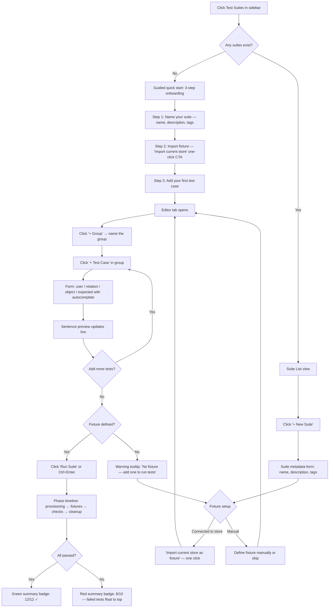
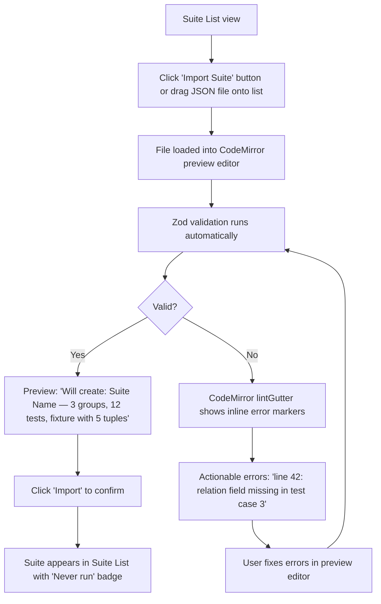
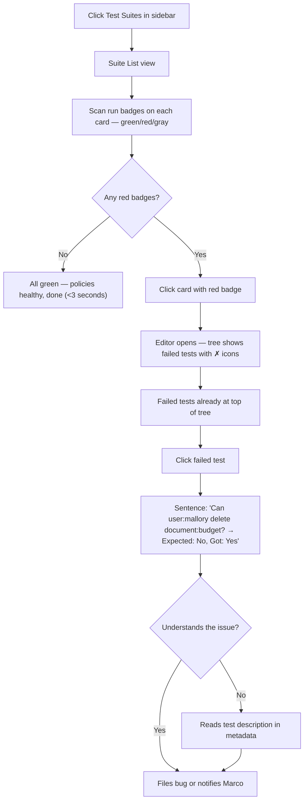
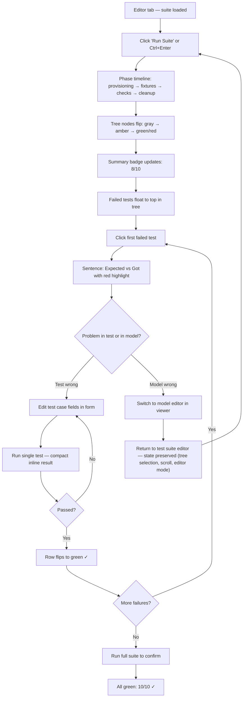
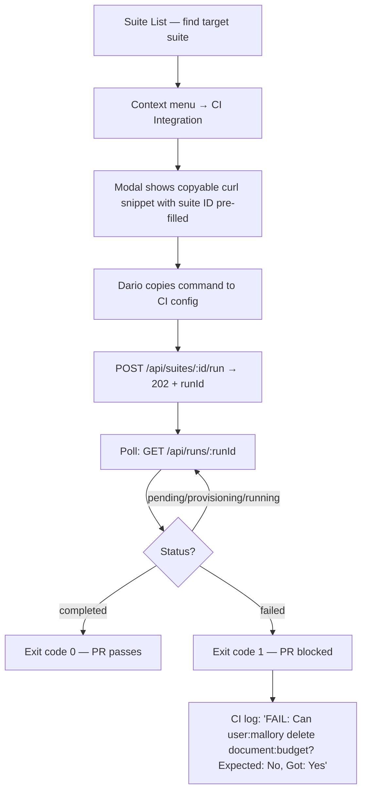

# UX Design Specification openfga-viewer

**Author:** monte
**Date:** 2026-03-31

**Scope:** Authorization Test Suite Management feature (FR1-FR45)

---

## Executive Summary

### Project Vision

The Authorization Test Suite Management module extends openfga-viewer from a passive inspection tool into an active verification platform. Users define test suites — collections of authorization assertions grouped thematically — execute them against ephemeral OpenFGA stores, and review results. The module serves both as a regression testing tool for CI/CD pipelines and as living documentation of authorization policies.

The core UX promise: **make authorization policy verification as intuitive as reading a sentence** — "Can user:alice view document:budget?" — while providing the power and precision that developers and DevOps engineers demand.

### Target Users

- **Marco (Developer)** — Writes and maintains authorization models. Needs to define precise test cases (`user`, `relation`, `object`, `expected`), iterate rapidly in the editor, and integrate suites into CI/CD. Thinks in OpenFGA primitives. Values speed, keyboard shortcuts, and JSON editing.

- **Alessia (Product Manager)** — Reviews authorization policies for correctness against business rules. Needs to read test suites as human-understandable statements, glance at run results dashboards, and confirm policy health. Does not write JSON directly.

- **Monte (Trainer/Consultant)** — Uses test suites as teaching material and live demos. Needs polished run experiences that feel like presentations, import/export for sharing across environments, and clear visual feedback during execution.

- **Dario (DevOps Engineer)** — Integrates test suites into automated pipelines. Consumes the REST API directly (`POST /suites/:id/run` → poll → exit code). Needs reliable async execution, clear status reporting, and machine-readable results (JSON).

### Key Design Challenges

1. **Dual-Audience Readability** — The same test case must be editable as raw JSON for Marco and readable as a sentence for Alessia. The dual-mode editor (form ↔ JSON) must round-trip losslessly with JSON as the source of truth, and both views must feel like first-class citizens.

2. **Hierarchical Editor Complexity** — Suites contain groups, groups contain test cases, each with metadata (name, description, tags, severity). The editor must make this hierarchy navigable without overwhelming the user — progressive disclosure is the organizing principle, not just a technique.

3. **Async Execution Feedback** — Runs go through multiple phases (provisioning → loading fixtures → running checks → cleanup), each with latency. A single progress bar will feel broken. The UX must present execution as a **phase timeline** where each step is visible progress, turning async latency into narrative momentum.

4. **Consistency with Existing Viewer** — The test suite module lives within the existing openfga-viewer shell (sidebar navigation, connection/store context). It must feel native, reusing existing design patterns (Tailwind v4.2, Headless UI) while introducing new interaction paradigms (dual-mode editor, run timeline).

### Design Opportunities

1. **Test Cases as Sentences** — Transform `{ user: "user:alice", relation: "viewer", object: "document:budget", expected: true }` into "Can user:alice view document:budget? → Yes". This makes test suites readable as policy documentation for non-technical stakeholders.

2. **Run as Narrative** — The ephemeral store lifecycle (create → load → execute → cleanup) maps naturally to a visual timeline. Each phase becomes a "chapter" with cascading green checkmarks, making execution feel purposeful rather than opaque.

3. **Progressive Disclosure as Scope Management** — Day-one surface: suite list with last-run badges. Power-user unlock: JSON dual-mode editor, run history, import/export. This naturally solves the dual-audience problem and keeps the initial experience approachable.

4. **Form ↔ JSON Trust Indicator** — A subtle "JSON synced ✓" indicator in form mode builds user confidence that switching views preserves data integrity.

## Core User Experience

### Defining Experience

The defining experience is the **edit → run → review loop**. During active development, users iterate rapidly: adjust a test case, run the suite, inspect results, repeat. Once suites stabilize, execution becomes a simpler one-click confirmation ("are my policies still correct?"). The edit phase dominates interaction count; the run phase dominates emotional weight.

### Platform Strategy

- **Web SPA** embedded in the existing openfga-viewer shell (sidebar navigation, connection/store context)
- **Desktop browser only**, mouse + keyboard as primary input
- No mobile, no offline, no touch optimization
- Keyboard shortcuts are critical for the developer persona (Marco) — suite editor must be fully keyboard-navigable
- Click-through paths must be clear for the PM persona (Alessia) — no hidden actions behind keyboard-only shortcuts

### Effortless Interactions

1. **Creating a test case** — 4 fields (user, relation, object, expected) with autocomplete sourced from the connected store's model. Zero mental overhead from "I want to test this" to "the assertion exists."
2. **Running a suite** — Single action (button or shortcut), immediate visual feedback via the phase timeline. No configuration dialogs, no confirmation modals.
3. **Reading results** — Pass/fail is visible at a glance (color + icon). Failed tests surface first. Drill-down to details is one click.
4. **Switching form ↔ JSON** — Instant, lossless, no "save before switching" friction. The "JSON synced ✓" indicator removes doubt.

### Critical Success Moments

1. **First run completes** — The user sees the phase timeline cascade through provisioning → fixtures → checks → cleanup, ending with a green summary. This is the "it works!" moment that builds trust in the entire system.
2. **First failure caught** — A test returns `actual: false` when `expected: true`. The user sees exactly which assertion failed and why. This is the "this is useful" moment.
3. **Suite imported and runs on first try** — A colleague's exported suite loads, executes, and produces results without manual edits. This is the "this is shareable" moment.
4. **CI pipeline exits non-zero** — Dario's `POST /suites/:id/run` → poll → exit code 1 catches a regression before merge. This is the "this is essential" moment.

### Experience Principles

1. **Sentence-first** — Every test case is readable as a natural language question ("Can user:alice view document:budget?"). Technical notation is available but secondary.
2. **Progressive disclosure** — The suite list is day-one simple. The JSON editor, run history, import/export, and advanced metadata unlock as the user needs them.
3. **Async as narrative** — Execution latency is reframed as a visible phase timeline. Every second of waiting shows progress, not stalling.
4. **Trust through transparency** — Form ↔ JSON sync is visible. Run phases are visible. Ephemeral store lifecycle is visible. Nothing happens behind an opaque curtain.

## Desired Emotional Response

### Primary Emotional Goals

- **Confidence** — "I trust that these tests accurately reflect my authorization policies." The tool never leaves the user guessing about state, sync status, or correctness.
- **Efficiency** — "I defined 20 test cases in 5 minutes." The edit loop feels fast and fluid, not bureaucratic or ceremony-heavy.
- **Relief** — "All green. My policies are correct." Run completion is a moment of tension release — the payoff for the work invested in defining assertions.

### Emotional Journey Mapping

| Stage | Emotion | Trigger |
|-------|---------|---------|
| First discovery | Curiosity | "I can test my policies here?" — the module appears in the sidebar alongside familiar viewer tools |
| First test case created | Empowerment | 4-field form with autocomplete makes the first assertion trivial |
| First run launched | Anticipation | Phase timeline starts cascading — something is happening |
| Run completes (pass) | Relief + Satisfaction | Green summary, all assertions confirmed |
| Run completes (fail) | Alertness + Gratitude | Red highlight on failed test — "glad I caught this before production" |
| Suite shared/imported | Connection | A colleague's suite loads and runs without edits — shared understanding |
| Returning user | Calm confidence | Suite list with last-run badges gives instant health overview |

### Micro-Emotions

- **Confidence vs. Confusion** — Critical. Every interaction must reinforce "I know what's happening." The phase timeline, sync indicator, and clear pass/fail signals all serve this.
- **Trust vs. Skepticism** — The dual-mode editor is the battleground. The "JSON synced ✓" indicator and lossless round-trip are the weapons.
- **Accomplishment vs. Frustration** — Test case creation must feel like progress, not data entry. Autocomplete and sensible defaults turn form-filling into assertion-building.

### Design Implications

- **Confidence** → Visible state everywhere: run phase, editor sync status, save confirmation, last-run badge on suite cards
- **Efficiency** → Keyboard shortcuts, inline editing, autocomplete, single-action run, no confirmation modals for non-destructive actions
- **Relief** → Run completion animation (subtle, not flashy), green cascade, clear summary with counts
- **Alertness on failure** → Failed tests surface first, red accent without alarm-style anxiety, clear "expected vs. actual" display
- **Trust** → Form ↔ JSON sync indicator, no hidden state, ephemeral store lifecycle visible in timeline

### Emotional Design Principles

1. **State is always visible** — The user never wonders "what's happening?" or "did that save?" Every async operation, sync event, and status change is communicated visually.
2. **Errors inform, not alarm** — Failures are expected outcomes in a testing tool. Red means "attention needed," not "something broke." The tone is diagnostic, not catastrophic.
3. **Speed builds trust** — Fast transitions, instant editor switching, responsive autocomplete. Perceived performance reinforces the feeling that the tool is reliable.
4. **Completion is celebrated subtly** — A green cascade, a summary count, a badge update. Not confetti — just quiet confirmation that the work paid off.

## UX Pattern Analysis & Inspiration

### Inspiring Products Analysis

**Postman — Collection Runner**
- Solves the "define and execute API assertions" problem with a hierarchical organizer (collections → folders → requests) that maps directly to our suite → group → test case model
- Dual-mode editing: form-based request builder alongside raw body editor. Users pick their comfort level without losing capability
- Run results appear inline next to each request — no context switch between "what I defined" and "what happened"
- Tags and search for organizing large collections; badge indicators for last-run status

**Playwright UI Mode — Test Runner**
- Tree view on the left with test files and describe blocks; execution status updates live per node
- Each test gets a clear pass/fail icon that updates in real-time during execution — the cascading green checkmarks pattern
- Failed tests auto-expand to show error details; passing tests stay collapsed — progressive disclosure driven by outcome
- Retry and run-single-test are one-click actions from the tree

**GitHub Actions — Job Timeline**
- Multi-phase job execution displayed as a vertical timeline with status icons per step
- Each phase is expandable for detail, collapsed by default — exactly the pattern for our provisioning → fixtures → checks → cleanup timeline
- Clear visual distinction between running (spinner), passed (green check), failed (red X), and skipped (gray dash)
- Duration shown per step with **live elapsed timer** on the active step — counting `provisioning... 2s` is better than a static spinner and directly serves the "async as narrative" principle

**VS Code Settings UI — Dual-Mode Editor**
- Form view over a JSON file with a toggle to switch between visual editor and raw JSON — the closest analogue to our CodeMirror ↔ form architecture
- Lossless round-trip: edits in form update JSON live, and vice versa
- Search works across both views — typing a keyword highlights matches whether in form mode or JSON mode
- Remembers the user's last view preference across sessions

### Transferable UX Patterns

**Navigation Patterns:**
- **Tree sidebar for hierarchy** (Playwright) — suite list → group → test cases navigable as a collapsible tree. Familiar to developers, scannable for PMs.
- **Inline results next to definitions** (Postman) — test case definition and its last result share the same row. No navigation to a separate "results" page.

**Interaction Patterns:**
- **Cascading status updates** (Playwright) — during execution, each test case node updates from pending → running → pass/fail in sequence. Turns async polling into visible narrative.
- **Run from any level** (Postman) — run the whole suite, a single group, or a single test case. Same action, different scope.
- **Fail-first sorting** (Playwright) — failed tests float to the top of results. The most important information is always visible first.
- **Cross-view search** (VS Code) — search input filters/highlights matching test cases in both form mode and JSON mode. One search box, both views.
- **Live elapsed timer** (GitHub Actions) — active run phase shows a ticking elapsed counter, turning wait time into visible progress.

**Visual Patterns:**
- **Phase timeline with expandable steps** (GitHub Actions) — vertical step list with status icon, label, and duration. Collapsed by default, expandable for detail.
- **Minimal color palette for status** (all four) — green/red/gray/amber. No gradients, no complex iconography. Status is communicated through color + simple icon.

### Anti-Patterns to Avoid

- **Separate results page** — Forcing navigation away from the test definition to see results breaks the edit → run → review loop. Results must be visible in context.
- **Modal-heavy configuration** — Pre-run configuration dialogs add friction. Our run action must be zero-config (single click/shortcut).
- **Opaque progress** — A single spinner with "Running..." gives no sense of progress or phase. Always show which phase is active and how many tests have completed.
- **Overcrowded toolbars** — Dense filter bars and option rows on first view. Our suite editor should surface only the current action's controls; everything else lives behind progressive disclosure.
- **Mode amnesia** — Resetting the editor to the default view (form) every time the user navigates away and returns. If Marco switches to JSON mode, it must persist across navigation. Respect the user's last choice — this directly supports the trust emotion.

### Design Inspiration Strategy

**Adopt directly:**
- Phase timeline with per-step status icons and live elapsed timer (GitHub Actions) → our run execution view
- Cascading pass/fail updates in tree view (Playwright) → our test result rendering
- Fail-first result sorting (Playwright) → our results display order
- Form ↔ JSON toggle with lossless round-trip (VS Code Settings) → our dual-mode editor

**Adapt for our context:**
- Collection runner inline results (Postman) → simplified to show last-run pass/fail badge on each test case row
- Tree sidebar navigation (Playwright) → adapted for suite → group → test case hierarchy with sentence-mode rendering for non-technical users
- Cross-view search (VS Code) → scoped to suite editor context, filtering test cases by user/relation/object/description

**Avoid:**
- Separate results pages — conflicts with edit → run → review loop principle
- Configuration modals before run — conflicts with "single action, no dialogs" effortless interaction goal
- Complex filtering UI on first view — conflicts with progressive disclosure principle
- Mode amnesia — conflicts with trust through transparency principle

## Design System Foundation

### Design System Choice

**Tailwind CSS v4.2 + Headless UI** — continuing the existing openfga-viewer design system. No new UI framework introduced.

The only new UI dependency is **CodeMirror 6** for the JSON dual-mode editor, already decided at the architecture level.

### Rationale for Selection

1. **Visual consistency** — The test suite module lives inside the existing viewer shell. Same design system = native feel, no visual seams between existing and new features.
2. **Zero learning curve** — Solo developer already proficient with the stack. No onboarding cost, no new abstractions to internalize.
3. **Component coverage** — Headless UI provides the accessible primitives needed: Combobox (autocomplete for user/relation/object fields), Tabs (form ↔ JSON toggle), Dialog (delete confirmation), Listbox (severity/tag selectors).
4. **Pattern implementability** — All inspiration patterns (tree sidebar, phase timeline, cascading status, inline results) are achievable with Tailwind utilities and custom components. No gap requiring a heavier library.

### Implementation Approach

- **Existing components reused** — Navigation sidebar items, button styles, badge patterns, card layouts from the viewer module carry over directly.
- **New components built** — Phase timeline, test case row, suite card, run summary, status badges — all built as Vue 3 components styled with Tailwind utilities on Headless UI primitives where applicable.
- **CodeMirror 6 theming** — A thin custom theme matching the Tailwind color palette (gray-50/700/900 for backgrounds, green/red/amber for status) ensures the JSON editor doesn't feel like a foreign embed.

### Customization Strategy

- **Design tokens via Tailwind config** — Status colors (pass green, fail red, running amber, pending gray), spacing scale, and typography are defined in `tailwind.config` and consumed consistently across both viewer and test suite modules.
- **Component composition over abstraction** — No shared component library project. Components are composed from Tailwind utilities + Headless UI primitives directly in each Vue file. Patterns are consistent by convention (documented in this spec), not by shared code.
- **CodeMirror integration** — The CodeMirror theme reads from CSS custom properties set by Tailwind, ensuring dark/light mode consistency if added in the future.

## Defining Core Experience

### Defining Experience

**"Write what you expect, run it, see if you're right."**

The one-sentence description users will tell colleagues: "I write authorization assertions in plain language, run them against an ephemeral store, and see pass/fail instantly." The atomic interaction is: **"Can user:alice view document:budget? → Run → Yes ✓"**

This is the test-framework mental model (define → execute → assert) applied to authorization policies, with a visual editor replacing code.

### User Mental Model

**Current workflow (without this module):**
- Developers verify authorization by manually calling `check` via CLI, curl, or the existing viewer's Query Permissions tab — one assertion at a time, no persistence, no grouping, no history
- It's like testing code by typing expressions in a REPL: useful for exploration, useless for regression testing

**Mental model they bring:**
- Test frameworks (Jest, Playwright, pytest): "I define assertions, I run them, I see red/green"
- The module adopts this model but replaces code with a visual editor and replaces local test fixtures with ephemeral OpenFGA stores

**Where confusion is likely:**
- The ephemeral store concept — "why doesn't it run against my real store?" — needs clear messaging in the UI ("Tests run in an isolated environment to protect your data")
- Fixture vs. existing tuples — users may expect tests to use the tuples already in their connected store. The fixture concept (suite carries its own data) needs to be discoverable, not assumed

### Success Criteria

1. **"This just works"** — A new user creates a test case, hits Run, and sees results within 30 seconds. No configuration, no prerequisite steps beyond having a connected OpenFGA instance.
2. **"I feel smart"** — The sentence rendering makes the user feel they've written something readable and shareable, not just filled in a form. The output looks like documentation.
3. **"I trust this"** — The phase timeline shows every step of execution. The user never wonders "is it stuck?" or "what's happening?" The form ↔ JSON sync indicator confirms nothing is lost.
4. **"This is fast"** — Autocomplete responds in <100ms. Editor mode switching is instant. Run initiation is a single action. Results appear as each test completes, not all at once at the end.

### Novel UX Patterns

**Established patterns adopted:**
- Hierarchical editor with collapsible tree (Postman collections)
- Pass/fail cascading status in tree view (Playwright UI Mode)
- Phase timeline with expandable steps (GitHub Actions)
- Form ↔ JSON dual-mode toggle (VS Code Settings)

**Novel combination — our unique twist:**
- **Sentence rendering** layered on top of the established test-case form. The same data (`user`, `relation`, `object`, `expected`) is displayed as "Can user:alice view document:budget? → Yes" in sentence mode and as structured JSON in code mode. This transforms a developer testing tool into readable policy documentation — the bridge between Marco and Alessia.
- **Failure sentence rendering** — When a test fails, the sentence becomes the primary diagnosis surface: "Can user:alice view document:budget? → Expected: **Yes**, Got: **No**" with color-coded mismatch. Alessia can understand failures without interpreting JSON diffs or asking Marco.
- **Run as narrative** — the phase timeline tells the story of the ephemeral store lifecycle (created → loaded → tested → destroyed). This is novel in the testing tool space, where execution is typically a black box.

### Experience Mechanics

**1. Initiation:**
- User clicks "+ Test Case" button in a group panel, or navigates to JSON mode and types directly
- Autocomplete activates on focus for user, relation, and object fields, sourced from the connected store's authorization model
- Keyboard shortcuts avoid browser collisions (no `Ctrl+N`); rely on in-context button actions and editor-scoped bindings

**2. Interaction:**
- **Form mode:** 4 fields — user (Combobox), relation (Combobox), object (Combobox), expected (toggle true/false). Optional metadata expands on demand: description, tags, severity.
- **JSON mode:** CodeMirror 6 editor with syntax highlighting, bracket matching, and validation. Edits reflect immediately in form mode.
- **Sentence preview:** Live rendering below the form: "Can user:alice view document:budget? → Yes" updates as fields change.

**3. Run Granularity:**
- **Suite-level:** "Run Suite" button or `Ctrl+Enter` from anywhere in the editor. Full phase timeline with narrative progression.
- **Group-level:** Run icon on each group header. Same phase timeline, scoped to group's test cases.
- **Single-test:** Run icon on each test case row. **Compact inline result** — the row flips directly to pass/fail with a duration badge, skipping the full phase timeline (4 phases for 1 check is overkill UX). Provisioning/cleanup happens transparently.

**4. Feedback:**
- **Phase timeline (suite/group runs):** Provisioning (spinner, elapsed timer ticking) → Fixtures loaded ✓ → Running checks (3/10, 4/10... progress counter) → Cleanup ✓
- **Per-test results:** Each test case row flips from pending (gray) → running (amber spinner) → pass (green ✓) or fail (red ✗) as results arrive via polling.
- **Failure detail:** Sentence view shows "Expected: **Yes**, Got: **No**" inline with color coding. Drill-down panel shows full test case definition for editing.
- **Error handling:** If provisioning fails, the timeline shows the failed phase with an expandable error message. No silent failures.

**5. Completion:**
- **Summary badge:** "8/10 passed" with pass/fail/total counts and total duration.
- **Fail-first sorting:** Failed tests float to the top of the results list.
- **Next action:** User edits the failing assertion or the authorization model, then runs again. The loop restarts.

## Visual Design Foundation

### Color System

**Inherited from existing viewer** — Tailwind v4.2 default palette with existing project customizations.

**New semantic colors for test suite module:**

| Semantic Role | Tailwind Token | Usage |
|---------------|---------------|-------|
| Pass | `green-500` / `green-50` (bg) | Passed test cases, completed phases, summary badge |
| Fail | `red-500` / `red-50` (bg) | Failed test cases, failed phases, error messages |
| Running | `amber-500` / `amber-50` (bg) | Active phase, currently executing test, spinner accent |
| Pending | `gray-400` / `gray-50` (bg) | Tests not yet executed, queued phases |
| Skipped | `gray-300` | Tests excluded from run |
| Info | `blue-500` / `blue-50` (bg) | Informational badges (tags, severity), sync indicator |

**Status color principle:** 4 colors maximum in any single view (pass/fail/running/pending). No gradients. Status is always color + icon — never color alone (color-blind accessibility).

### Typography System

**Inherited from existing viewer** — system font stack via Tailwind defaults.

**Test suite module additions:**

| Element | Style | Purpose |
|---------|-------|---------|
| Sentence rendering | `text-base` (16px), regular weight, proportional font | "Can user:alice view document:budget? → Yes" — reads as prose |
| Technical tokens in sentences | `text-base bg-gray-100 rounded px-1` (background pill) | `user:alice`, `viewer`, `document:budget` — visually distinct without breaking reading rhythm. Pills instead of font-mono switching keep the sentence feeling like prose with highlighted terms |
| Phase timeline labels | `text-sm font-medium` | "Provisioning", "Loading fixtures", "Running checks" |
| Summary counts | `text-2xl font-bold` | "8/10" in run summary badge |
| CodeMirror editor | `font-mono text-sm` | JSON editing — matches typical code editor sizing |
| Test case metadata | `text-xs text-gray-500` | Description, tags, severity — secondary information |

**Tone:** Professional-clean, not playful. No decorative typography. The sentence rendering is the personality — the typography gets out of the way.

### Spacing & Layout Foundation

**Layout feel:** Dashboard — airy and spacious, not dense.

**Spacing scale:** Tailwind default (4px base unit). Key spacing decisions:

| Context | Spacing | Rationale |
|---------|---------|-----------|
| Suite cards in list | `gap-4` (16px) | Breathing room between cards, scannable dashboard feel |
| Groups within suite editor | `gap-6` (24px) | Clear visual separation between groups |
| Test cases within group | `gap-2` (8px) | Tighter grouping — test cases belong together |
| Phase timeline steps | `gap-3` (12px) | Vertical rhythm that reads as a sequence |
| Form fields | `gap-4` (16px) | Standard form spacing, comfortable for mouse targets |
| Section padding | `p-6` (24px) | Generous panel padding, dashboard feel |

**Layout structure:**
- **Suite list view:** Card grid or list (responsive), each card shows name, description, tags, last-run badge
- **Suite editor view:** Two-column — collapsible left panel (tree navigation: groups + test cases, ~280px expanded, thin icon strip when collapsed), right panel (editor: form/JSON tabs + run controls)
- **Run summary badge:** Positioned in the **editor panel header**, always visible regardless of tree panel state. "8/10 passed" is the most important status information and must never be hidden.
- **Run results view:** Integrated into the editor — results appear below/alongside the test case definitions, not on a separate page

**Dashboard principle:** White space is a feature, not waste. Every element has room to breathe. This differentiates the module from dense developer tools and supports the "calm confidence" emotional goal.

### CodeMirror 6 Theme Integration

The CodeMirror 6 JSON editor uses its own `EditorView.theme()` API, not CSS utility classes. Integration approach:

- Define a single `tailwindCodeMirrorTheme` module that maps Tailwind color hex values to CodeMirror theme facets
- Reference the same hex values from `tailwind.config` — one source of truth for colors
- Do not attempt to make CodeMirror consume Tailwind utility classes (maintenance trap)
- Theme covers: background, text color, selection, bracket matching, syntax highlighting (strings, numbers, keys, booleans mapped to Tailwind palette)

### Accessibility Considerations

- **Color + icon:** Every status uses both color and an icon (✓, ✗, spinner, dash). Never color alone.
- **Contrast ratios:** All text meets WCAG 2.1 AA minimum (4.5:1 for normal text, 3:1 for large text). Tailwind's default palette achieves this for the chosen tokens.
- **Keyboard navigation:** All interactive elements (buttons, form fields, tree nodes, tabs) must be focusable and operable via keyboard. Headless UI components provide this by default.
- **Focus indicators:** Visible focus rings on all interactive elements (Tailwind's `ring` utilities).
- **Screen reader support:** Phase timeline steps use `aria-label` for status ("Provisioning: completed", "Running checks: in progress 4 of 10"). Test case pass/fail uses `aria-live="polite"` for dynamic updates.

## Design Direction Decision

### Design Directions Explored

Three layout directions were prototyped as an interactive HTML showcase (`ux-design-directions.html`):

- **Direction A (Dashboard First)** — Card grid suite list, narrow tree + wide editor, results on a separate tab with summary banner and phase timeline
- **Direction B (Editor First)** — Compact table suite list, equal 50/50 split editor, results in a separate bottom-panel-style tab
- **Direction C (Hybrid)** — Full-width card suite list, collapsible tree + dominant editor, results integrated inline in the editor panel

### Chosen Direction

**Direction C: Hybrid** — combines the dashboard feel of Direction A's suite list with the editor efficiency of Direction B, while uniquely integrating results inline and providing a collapsible tree panel.

### Design Rationale

1. **No separate results page** — Results appear integrated in the editor panel (failed test sentence rendering, inline pass/fail per row). This preserves the edit → run → review loop without context switching.
2. **Collapsible tree panel** — ~280px expanded, thin icon strip when collapsed. Preserves dashboard spacing on standard screens, reclaims space when the editor needs room. Collapsed tree badges update live during runs from the same Pinia store as the expanded tree (single data source, two render paths).
3. **Run summary in editor header** — "8/10 passed" badge is always visible regardless of tree panel state. The most critical status information is never hidden.
4. **Full-width suite cards** — Single-column card layout capped at `max-w-3xl` (768px), left-aligned. Run badge positioned inline next to the suite name (not exiled to the far right margin) for a tight scan path on wide screens.
5. **Two tabs only** — "Suites" (list) and "Editor" (tree + form/JSON + results). No separate Results tab. Fewer navigation targets, faster mental model.
6. **Suite-level context menu** — Three-dot icon on each suite card opens a Headless UI `Menu` dropdown with Edit Metadata, Import, Export, Delete. This keeps the Editor tab focused on the edit → run → review loop while the Suite List serves as the management hub.

### Implementation Approach

- **Suite List View:** `SuiteList.vue` renders full-width `SuiteCard` components in a single-column `space-y-4 max-w-3xl` layout. Each card shows name + inline run badge, description, tags, context menu (three-dot), and run button.
- **Suite Editor View:** Two-panel layout — `SuiteTree.vue` (collapsible, ~280px) on the left, `SuiteEditorPanel.vue` on the right. Editor panel has sticky header with form/JSON toggle, sync indicator, run summary badge, and run button.
- **Integrated Results:** Test case rows in the tree show pass/fail icons. Selected test case in the editor shows sentence rendering with failure detail inline. Run timeline is a collapsible `
` element below the editor.
- **Collapsed Tree:** `SuiteTreeCollapsed.vue` renders a thin icon strip with group-level pass/fail summary badges. Badges are reactive to the same `runs` Pinia store, ensuring live updates during execution.

## User Journey Flows

### J1: First Suite Creation (Marco)

**Goal:** Marco creates his first test suite with test cases and runs it successfully.

**Entry point:** Clicks "Test Suites" in sidebar → sees empty state on Suite List.

**Key UX moments:**
- Empty state uses guided quick start (3 numbered steps with progress indicator) — disappears after first suite exists
- "Import current store as fixture" is the zero-friction path for fixture setup
- Missing fixture produces a warning tooltip on the Run button, not a blocking modal
- Autocomplete on first field focus is the "this is easy" moment
- Sentence preview appearing live is the "I feel smart" moment

### J1b: Suite Import

**Goal:** Marco or Monte imports a test suite from a JSON file.

**Entry point:** Suite List → Import button or drag-and-drop on the list view.

**Key UX moments:**
- Import validation reuses the same Zod schemas as the API — zero duplication
- CodeMirror lintGutter shows errors inline in the JSON, not in a separate error list
- Preview summarizes what will be created before committing
- Errors are specific and actionable, mapped to line numbers

### J2: Policy Health Review (Alessia)

**Goal:** Alessia checks if authorization policies are healthy across all suites.

**Entry point:** Clicks "Test Suites" in sidebar → scans Suite List.

**Key UX moments:**
- Suite List scan with badges is the "dashboard glance" — readable in <3 seconds
- Alessia never touches form fields or JSON — she reads sentences and badges only
- Failure sentence with "Expected: No, Got: Yes" is self-explanatory without developer context

### J3: Run and Debug Failures (Marco)

**Goal:** Marco runs a suite, identifies failures, fixes them, and re-runs until green.

**Entry point:** Already in Editor tab with a suite open.

**Key UX moments:**
- Run-single-test uses compact inline result (row flip + duration badge), not full phase timeline
- **Editor state preservation** — when navigating away to model editor and returning, tree selection, scroll position, and form/JSON mode are all preserved (stored in Pinia, not component-local state)
- The "test wrong" vs "model wrong" fork is the debugging decision point — both paths must be equally accessible

### J5: CI/CD Integration Setup (Dario)

**Goal:** Dario configures a CI pipeline to run a test suite on every PR.

**Entry point:** Suite already exists. Dario needs API details.

**UX touchpoint:** Context menu includes "CI Integration" option showing a copyable curl command with the suite ID pre-filled. Sentence format appears in CI log output too — consistent language across UI and API.

### Journey Patterns

**Navigation: List → Detail → Action**
All journeys follow: Suite List (scan/select) → Editor (view/edit) → Run (action/feedback). Two tabs, one direction, no dead ends.

**Feedback: Progressive status revelation**
Status reveals progressively: Suite List shows summary badges → Editor tree shows per-test icons → Selected test shows full sentence with expected/actual. Each level adds detail without requiring the previous level.

**Error: Fail-first + sentence diagnosis**
Failures always float to the top. Diagnosis is always a readable sentence. Recovery is always "edit and re-run." No error requires leaving the current view.

**Consistency: Sentence everywhere**
The sentence format ("Can X do Y to Z? → Expected/Got") appears in: form preview, tree node labels, results, failure detail, import validation, and CI log output. One language across all touchpoints.

**State: Preserved across navigation**
Editor state (tree selection, scroll position, form/JSON mode, collapsed/expanded tree) persists in Pinia store, surviving navigation to other viewer modules and back.

### Flow Optimization Principles

1. **Minimum clicks to value** — First run: sidebar → new suite → import fixture → add test → run = 5 actions. Returning run: sidebar → click suite → run = 2 actions.
2. **No dead ends** — Every view has a clear next action. Empty states have guided quick start. Missing fixtures have warning with CTA. Failed tests have "edit" affordance.
3. **Inner loop speed** — Edit-single-test → run-single-test → check must complete in <5 seconds perceived time. Compact inline result makes this possible.
4. **Scan before drill** — Suite List badges give health overview without clicking. Tree icons give per-test status without selecting. Sentence gives diagnosis without expanding. Each layer is self-sufficient.
5. **Import is validate-then-confirm** — Upload → inline Zod validation in CodeMirror → preview summary → confirm. Never blind import.

## Component Strategy

### Design System Components (Reused from Existing Codebase)

The existing `components/common/` library provides 12 base components that cover the test suite module's foundational needs:

| Existing Component | Test Suite Usage |
|---|---|
| `AppBadge` | Run status badges (variant mapped: completed→success, failed→error, running→warning, pending→info) |
| `AppButton` | All action buttons; `loading` prop for Run Suite during execution |
| `AppCard` | Base wrapper for `SuiteCard` |
| `AppInput` | Test case form fields; `monospace` prop already supported |
| `AppTabs` | Form ↔ JSON editor toggle |
| `SearchableSelect` | Autocomplete for user, relation, object fields (Headless UI Combobox) |
| `AppSelect` | Severity selector, tag selector |
| `EmptyState` | Empty suite list (icon + title + message + CTA pattern) |
| `ConfirmDialog` | Delete suite confirmation, discard unsaved changes |
| `FileImportDropzone` | Suite import — drag-and-drop JSON with built-in structure validation |
| `LoadingSpinner` | Phase timeline active step indicator |
| `ToastContainer` | Run complete/failed toast notifications |

**No new base components needed.** The existing library is sufficient.

### Custom Components

9 custom components specific to the test suite module, all placed in `components/test-suites/`:

#### SuiteCard

**Purpose:** Suite list item displaying suite identity, status, and actions.
**Reuses:** `AppCard`, `AppBadge`, Headless UI `Menu`
**Content:** Suite name (inline with run badge), description, tags, last-run timestamp, test/group counts
**Actions:** Click to open editor, context menu (Edit Metadata, CI Integration, Import, Export, Delete), run button
**States:** Default, hover (card-hover elevation), has-failures (red border accent), never-run (gray badge)
**Accessibility:** Keyboard-navigable card, context menu via Headless UI Menu (arrow keys, Enter, Escape)

#### SuiteTree

**Purpose:** Collapsible hierarchical navigator for groups and test cases within a suite.
**Reuses:** Lucide icons, `SentenceView`
**Content:** Groups (collapsible) → test cases (selectable). Each test case shows sentence-mode label with pass/fail icon.
**Actions:** Click group to expand/collapse, click test case to select (loads in editor panel), run icon per group and per test case, collapse panel toggle
**States:** Expanded/collapsed groups, selected test case (blue highlight), pass/fail/pending/running per node
**Accessibility:** Tree role with `aria-expanded`, arrow key navigation between nodes, Enter to select

#### SuiteTreeCollapsed

**Purpose:** Thin icon strip showing group-level summary when tree panel is collapsed.
**Reuses:** `AppBadge`
**Content:** Expand toggle + one badge per group showing pass/fail ratio
**States:** Badges update live during runs (reactive to `runs` Pinia store)
**Accessibility:** Each badge has tooltip with group name and counts

#### TestCaseForm

**Purpose:** 4-field editor for a single test case with live sentence preview.
**Reuses:** `SearchableSelect`, `AppInput`, `SentenceView`
**Content:** User (Combobox), Relation (Combobox), Object (Combobox), Expected (toggle: Allowed/Denied). Expandable metadata section: description, tags, severity.
**Actions:** Field editing with autocomplete, expected toggle, metadata expand/collapse, run-single-test button
**States:** Default (editing), pristine (unchanged), dirty (unsaved changes), result-pass, result-fail
**Accessibility:** Tab order through fields, autocomplete announced via aria-live, toggle buttons with aria-pressed

#### SentenceView

**Purpose:** Universal sentence rendering for test cases across all contexts — the single most reused custom component.
**Content:** "Can `user:alice` `view` `document:budget` ?" with technical tokens in background pills (`bg-gray-100 rounded px-1` in light context, adapted for dark theme)
**Variants by `result` prop:**
- `null` (editing): "Can X do Y to Z? → Yes" (neutral)
- `pass`: "Can X do Y to Z? → Yes ✓" (green)
- `fail`: "Can X do Y to Z? → Expected: Yes, Got: No" (red highlight on mismatch)
- `running`: "Can X do Y to Z? → ..." (amber spinner)
**Used in:** Tree node labels, form preview, results view, failure detail, import preview
**Accessibility:** Sentence is a single readable text node for screen readers; pills are decorative only

#### RunPhaseTimeline

**Purpose:** Vertical timeline showing execution phases with live status.
**Reuses:** `LoadingSpinner`
**Content:** 4 phases — Provisioning, Loading fixtures, Running checks (with progress counter N/M), Cleanup. Each phase shows: status icon (spinner/check/cross), label, elapsed timer.
**States per phase:** Pending (gray dash), running (amber spinner + ticking elapsed timer), completed (green check + final duration), failed (red cross + error message expandable)
**Accessibility:** List role, each phase has aria-label with status ("Provisioning: completed, 1.2 seconds")

#### RunSummaryBadge

**Purpose:** Composite badge showing pass/fail counts — always visible in editor header.
**Reuses:** `AppBadge` as styling base
**Content:** "8/10 passed" with icon (check or cross) and background color (green-50 or red-50)
**States:** All passed (green), has failures (red), running (amber with spinner), no runs (gray "Never run")
**Accessibility:** aria-label with full description ("8 of 10 tests passed")

#### JsonEditor

**Purpose:** CodeMirror 6 wrapper with Tailwind-compatible theme for JSON editing.
**Content:** Full JSON representation of the suite definition with syntax highlighting, bracket matching, validation
**Actions:** Edit JSON directly, changes sync to form view (JSON is source of truth)
**States:** Synced (green indicator), has-errors (red lint markers), read-only (for import preview)
**Integration:** `EditorView.theme()` API with hex values from existing CSS custom properties (`--color-success`, `--color-error`, etc.). Single theme file, one mapping.

#### ImportPreview

**Purpose:** Import validation and preview using CodeMirror with Zod lintGutter.
**Reuses:** `JsonEditor`, `FileImportDropzone`
**Content:** Uploaded JSON in CodeMirror editor with inline error markers, summary of what will be created ("3 groups, 12 tests, fixture with 5 tuples")
**Actions:** Edit in-place to fix errors, confirm import, cancel
**States:** Validating (spinner), valid (green summary + confirm button), invalid (red lint markers with actionable messages mapped to line numbers)
**Accessibility:** Error count announced via aria-live, lint markers navigable via keyboard

### Component Implementation Strategy

**Color tokens:** All components reference existing CSS custom properties (`--color-success`, `--color-error`, `--color-warning`, `--color-info`) from `main.css`, not raw Tailwind color classes. This ensures consistency with the existing dark theme.

**Composition pattern:** Custom components compose existing base components rather than reimplementing. `SuiteCard` wraps `AppCard` + `AppBadge` + `Menu`. `TestCaseForm` wraps `SearchableSelect` + `AppInput`. No duplication of base component behavior.

**State management:** Components that need live updates during runs (`SuiteTree`, `SuiteTreeCollapsed`, `RunPhaseTimeline`, `RunSummaryBadge`, `SentenceView`) are reactive to Pinia stores (`suites`, `runs`). No component-local polling — the store handles polling, components react.

**Editor state persistence:** Tree selection, scroll position, form/JSON mode, and collapsed/expanded tree state are stored in the `suites` Pinia store, not in component-local state. This ensures state survives navigation away and back.

### Implementation Roadmap

**Phase 1 — Core (needed for first working flow):**
- `SuiteCard` + `EmptyState` integration → Suite List view
- `SuiteTree` + `TestCaseForm` + `SentenceView` → Suite Editor view
- `JsonEditor` → Dual-mode editor

**Phase 2 — Execution (needed for run experience):**
- `RunPhaseTimeline` + `RunSummaryBadge` → Run feedback
- `SuiteTreeCollapsed` → Collapsible tree
- `SentenceView` result variants (pass/fail) → Results rendering

**Phase 3 — Management (needed for full workflow):**
- `ImportPreview` → Import flow with validation
- Context menu actions (Export, CI Integration snippet) → Suite management
- `GuidedQuickStart` content in `EmptyState` → First-time onboarding

## UX Consistency Patterns

### Button Hierarchy

**Primary action (one per view):**
- Suite List: "New Suite" — `AppButton variant="primary"`
- Editor: "Run Suite" / "Run" — `AppButton variant="primary"` with `loading` prop during execution
- Import Preview: "Import" — `AppButton variant="primary"`, disabled until validation passes

**Secondary actions:**
- Run single test / Run group — ghost button with play icon, no label (icon-only in tree, labeled in editor header)
- Form ↔ JSON toggle — `AppTabs` (not buttons). Active tab has bottom border accent, not fill.
- Expand/collapse metadata — text link style ("Show metadata ▾"), not a button

**Destructive actions:**
- Delete suite — always behind `ConfirmDialog`. Trigger is in context menu, never a top-level button.
- Discard unsaved changes — `ConfirmDialog` with "Discard" as destructive action label, "Keep editing" as safe default.

**Button placement rule:** Primary action is always top-right of its container. Run Suite is in editor header (right-aligned, next to RunSummaryBadge). New Suite is in suite list header. Consistency: user's eye always goes to top-right for the main action.

### Feedback Patterns

**Run status (4-tier progressive disclosure):**

| Level | Component | What it shows | When visible |
|-------|-----------|---------------|--------------|
| 1. Suite List | `SuiteCard` badge | "8/10 passed" or "Never run" | Always |
| 2. Editor header | `RunSummaryBadge` | "8/10 passed" + icon | Always in editor |
| 3. Tree nodes | `SuiteTree` icons | Per-test ✓/✗/spinner/dash | Always in tree |
| 4. Selected test | `SentenceView` result | Full sentence with Expected/Got | On test selection |

**Validation feedback:**
- Form fields: Inline error below field (red text, `text-sm`), appears on blur (not on keystroke). No error state on pristine fields.
- JSON editor: CodeMirror `lintGutter` with red markers at error lines. Error count in editor status bar.
- Import: Same lintGutter pattern + summary banner ("3 errors found — fix to enable import")

**Toast notifications:**
- Run complete (all passed): Success toast, auto-dismiss 4s — "Suite 'RBAC Tests' passed (10/10)"
- Run complete (failures): Error toast, persists until dismissed — "Suite 'RBAC Tests': 2 failures"
- Suite saved: Success toast, auto-dismiss 3s — "Suite saved"
- Import successful: Success toast, auto-dismiss 4s — "Imported 'Billing Policies' (3 groups, 12 tests)"

**Toast rules:** Use `ToastContainer`. Max 3 visible. Success auto-dismisses, errors persist. No toasts for intermediate states (running, provisioning) — those use inline phase timeline.

### Form Patterns

**Test case form (canonical 4-field pattern):**
1. **User** — `SearchableSelect` with autocomplete from known entities. Placeholder: "user:alice"
2. **Relation** — `SearchableSelect`, options filtered by model if available. Placeholder: "viewer"
3. **Object** — `SearchableSelect`. Placeholder: "document:budget"
4. **Expected** — Toggle button (Allowed/Denied), not a checkbox. Default: Allowed. Toggle uses `aria-pressed`.

**Autocomplete behavior:**
- Triggers on focus (not on character count threshold) — this is the "this is easy" moment
- Options from the connected store's model and tuples
- Free text allowed (not restricted to known entities) — users may test hypothetical scenarios
- Selected value shown in monospace (`font-mono`) inside the input

**Metadata section (progressive disclosure):**
- Collapsed by default. "Show metadata ▾" text link below the 4 fields.
- Contains: description (textarea), tags (multi-select), severity (select: critical/warning/info)
- Persists expand/collapse state per session in Pinia store

**Form ↔ JSON sync:**
- JSON is the source of truth. Form edits write to JSON model, form reads from JSON model.
- "JSON synced ✓" indicator in form mode (green text, bottom of form). Disappears during JSON editing.
- If JSON is manually edited with syntax errors, form shows "JSON has errors — fix in JSON tab" banner instead of form fields.

### Navigation Patterns

**Two-tab structure:**
- Tab bar: "Suites" | "Editor" — sticky at top of content area
- "Suites" shows `SuiteList`. "Editor" shows `SuiteTree` + `SuiteEditorPanel`.
- Clicking a suite card in the list auto-navigates to Editor tab with that suite loaded.
- Editor tab shows suite name in header as context (not a separate breadcrumb).

**Tree navigation:**
- Arrow keys navigate between tree nodes. Enter selects. Left/Right collapses/expands groups.
- Selected node has blue highlight (consistent with existing viewer sidebar style).
- Selection loads the corresponding content in the editor panel (test case form or group metadata).

**Context menu pattern:**
- Three-dot icon on each `SuiteCard` → Headless UI `Menu` dropdown
- Menu items: Edit Metadata, CI Integration, Import, Export, Delete
- Keyboard: Enter on three-dot opens menu, arrow keys navigate, Enter selects, Escape closes
- Destructive items (Delete) are visually separated with a divider and red text

**Mode persistence:**
- Form/JSON tab selection persists across navigation (stored in Pinia). No "mode amnesia."
- Tree collapse state persists. Returning to Editor tab restores exact tree state.

### Empty & Loading States

**Empty suite list:**
- `EmptyState` component with guided quick start (3 numbered steps with subtle progress indicator)
- Steps: 1) Name your suite, 2) Import fixture, 3) Add first test case
- Single CTA button: "Create your first suite"
- Disappears permanently after first suite exists

**Empty group:**
- Inline message within group: "No test cases yet" + "Add test case" ghost button
- Not a full-page empty state — groups are nested, so feedback is compact

**Loading during data fetch:**
- Suite list: Skeleton cards (3 gray pulse rectangles matching SuiteCard shape)
- Editor: Spinner centered in editor panel with "Loading suite..." text
- No skeleton for tree — tree populates instantly from already-fetched suite data

**Run in progress:**
- `RunPhaseTimeline` is the primary loading indicator — no separate spinner
- Tree nodes show amber spinner on running tests
- RunSummaryBadge shows amber state with spinner during run
- User CAN navigate away — run continues in background, badge updates when they return

### Modal & Overlay Patterns

**ConfirmDialog (destructive actions only):**
- Delete suite: "Delete 'Suite Name'?" / "This will permanently delete the suite and all run history." / [Cancel] [Delete]
- Discard changes: "Discard unsaved changes?" / "Your changes to 'Suite Name' will be lost." / [Keep editing] [Discard]
- Safe action is always the default (left button). Destructive action is right button with red variant.

**CI Integration modal:**
- Triggered from context menu "CI Integration"
- Content: Copyable curl snippet with suite ID pre-filled, brief polling instructions
- Single "Copy" button + "Close" — not a form, just reference content
- Uses `ConfirmDialog` shell (Headless UI `Dialog`) but with informational styling, not warning

**Import flow (panel, not modal):**
- Import is NOT a modal — it's a full editor-panel experience (replaces the editor content temporarily)
- FileImportDropzone → CodeMirror preview with validation → confirm/cancel buttons
- "Cancel" returns to previous editor state. "Import" creates suite and navigates to it.
- This avoids the "modal inside modal" problem and gives proper space for JSON editing

## Responsive Design & Accessibility

### Responsive Strategy

**Desktop-first developer tool.** The test suite module is designed for desktop workflows (model editing, JSON authoring, CI/CD integration). Tablet gets graceful degradation; mobile gets read-only status glance.

**Desktop (≥1280px) — Full experience:**
- Suite List: Single-column cards (`max-w-3xl`), generous `gap-4` spacing
- Editor: Two-column — tree panel (~280px) + editor panel (remaining width)
- Phase timeline and results render inline with comfortable spacing
- CodeMirror editor has room for 80+ character lines without horizontal scroll

**Large tablet / Small desktop (1024px–1279px) — Comfortable:**
- Suite List: Same layout, slightly tighter padding
- Editor: Tree panel starts collapsed (icon strip). User can expand on demand.
- Editor panel gets full width by default — more useful for JSON editing

**Tablet (768px–1023px) — Functional but simplified:**
- Suite List: Cards stretch to full width, context menu unchanged (touch-friendly via Headless UI)
- Editor: Tree panel hidden by default, accessible via hamburger-style toggle. Editor panel is full-width.
- CodeMirror: Font size bumped to 15px for touch readability
- Run controls: Buttons get minimum `h-11` (44px) touch targets

**Mobile (<768px) — Read-only dashboard:**
- Suite List only: Cards with run badges, tap to see suite detail (read-only sentence list)
- No editor, no JSON, no tree panel — these are not usable on mobile
- Run button available (tap to trigger, poll for results) but no editing
- Banner: "Use desktop for full editing experience"

### Breakpoint Strategy

Tailwind default breakpoints, desktop-first approach:

| Breakpoint | Tailwind | Behavior |
|------------|----------|----------|
| ≥1280px | `xl:` | Full two-column editor, tree expanded |
| 1024–1279px | `lg:` | Tree collapsed by default, expandable |
| 768–1023px | `md:` | Tree hidden, toggle to show. Full-width editor |
| <768px | Default | Suite list only, read-only mode |

**No custom breakpoints needed.** Tailwind defaults align with the layout shift points.

**Implementation approach:** Use `lg:` prefix for tree panel visibility. Editor panel uses `flex-1` to fill available space regardless of tree state. Suite cards use `max-w-3xl mx-auto` at all sizes (naturally responsive).

### Accessibility Strategy

**Target: WCAG 2.1 AA compliance.**

**Already covered by design decisions (Steps 8/11/12):**
- Color + icon for all status (never color alone)
- Contrast ratios ≥4.5:1 via Tailwind default palette on dark theme
- Headless UI components provide keyboard navigation, focus management, ARIA attributes
- `aria-live="polite"` for dynamic run status updates
- `aria-expanded` on tree nodes, `aria-pressed` on toggles
- Focus rings via Tailwind `ring` utilities

**Additional requirements:**

**Keyboard navigation map:**

| Context | Key | Action |
|---------|-----|--------|
| Suite List | `Tab` | Move between suite cards |
| Suite Card | `Enter` | Open suite in editor |
| Suite Card | `Space` | Open context menu |
| Tree | `↑/↓` | Navigate between nodes |
| Tree | `←/→` | Collapse/expand group |
| Tree | `Enter` | Select test case |
| Editor | `Ctrl+Enter` | Run suite |
| Editor | `Tab` | Move between form fields |
| Form/JSON tabs | `←/→` | Switch tab |
| Dialog | `Escape` | Close |

**Screen reader announcements:**
- Suite loaded: "Editing suite: [name], [N] groups, [M] test cases"
- Run started: "Running suite [name]"
- Run phase change: "Phase: [name], status: [status]"
- Run complete: "[N] of [M] tests passed" (via `aria-live`)
- Test result: "Test [description]: [passed/failed]"

**Focus management:**
- Opening editor: Focus moves to first form field or tree root
- Run complete: Focus stays on Run button (no focus steal)
- Dialog open: Focus trapped in dialog (Headless UI default)
- Dialog close: Focus returns to trigger element
- Import confirm: Focus moves to newly created suite card

### Testing Strategy

**Responsive testing (pragmatic for solo dev):**
- Chrome DevTools device toolbar for breakpoint verification
- Actual test on one tablet if available (iPad Safari)
- No dedicated mobile testing — mobile is intentionally limited

**Accessibility testing:**
- `eslint-plugin-vuejs-accessibility` in CI — catches missing ARIA attributes, alt text, label associations
- Manual keyboard-only navigation pass per epic (Tab through full flow without mouse)
- axe DevTools browser extension for contrast and structure audits
- No screen reader testing in CI — manual spot-check with VoiceOver or Orca per release

**What NOT to test (pragmatic scope):**
- Mobile touch gesture edge cases (not a mobile app)
- JAWS/NVDA (Windows screen readers) — Linux dev environment, VoiceOver/Orca sufficient
- AAA contrast compliance (AA is the target)

### Implementation Guidelines

**Responsive development:**
- Use Tailwind responsive prefixes (`lg:`, `md:`) — no custom media queries
- Tree panel visibility: `hidden lg:block` with manual toggle override stored in Pinia
- Touch targets: All buttons `min-h-[44px] min-w-[44px]` on `md:` and below
- CodeMirror container: `min-h-[300px]` to prevent collapse on smaller viewports
- No horizontal scroll — JSON lines wrap in CodeMirror (`EditorView.lineWrapping`)

**Accessibility development:**
- Semantic HTML: `<nav>` for tree, `<main>` for editor, `<section>` for suite cards, `<form>` for test case editor
- Headless UI handles: Dialog focus trap, Menu keyboard navigation, Combobox ARIA, Tab ARIA
- Custom components must add: `role="tree"` / `role="treeitem"` on SuiteTree, `aria-label` on icon-only buttons, `aria-live` on RunSummaryBadge and phase status
- Skip link: "Skip to editor" link visible on focus, jumps past tree panel to editor content
- Reduced motion: `@media (prefers-reduced-motion: reduce)` — disable phase timeline animations, replace spinners with static "..." text
