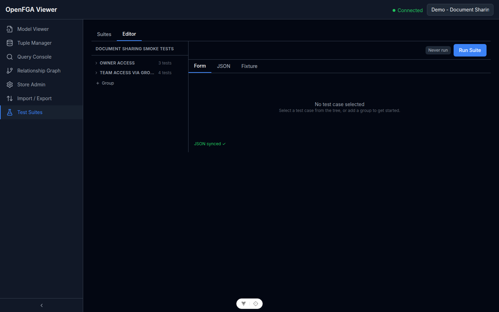
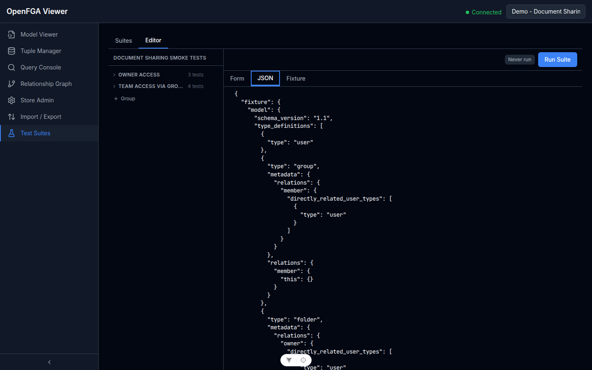
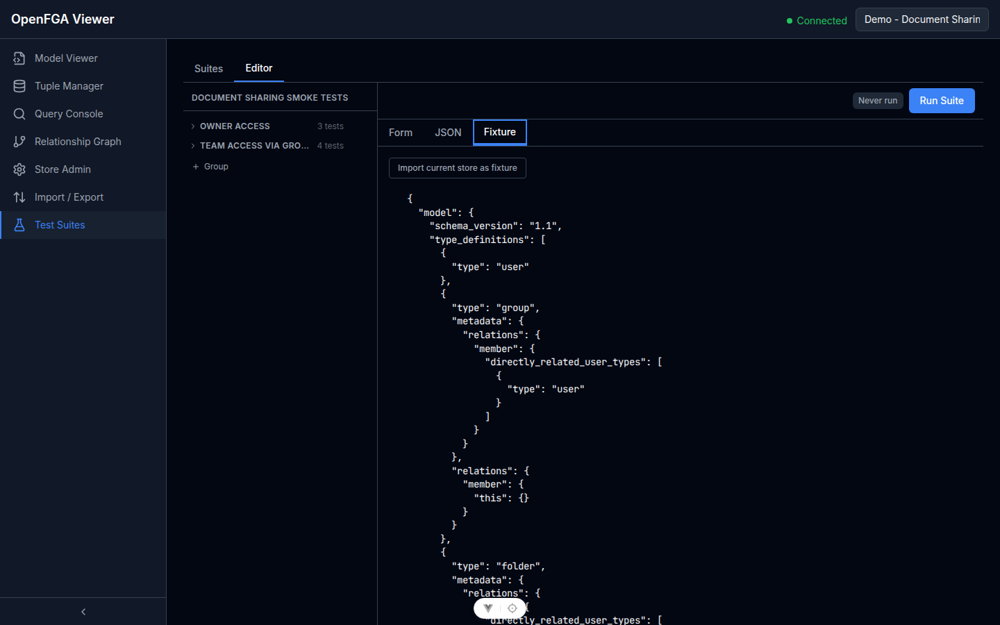

# Suite Editor

Open a suite from the Test Suites list to enter the editor. The editor has three tabs: **Form**, **JSON**, and **Fixture**.

## Form Editor

The Form tab provides a structured way to manage groups and test cases.



### Groups

Groups are collapsible sections that organize related test cases. A suite can have any number of groups.

**Add a group:** Click **+ Add Group** at the bottom of the suite tree. Enter a name and optional description.

**Delete a group:** Click the **⋯** menu on the group header → **Delete group**. This also deletes all test cases in the group.

**Reorder groups:** Drag the group handle (≡) to a new position.

### Test Cases

Each test case specifies a permission check.

**Add a test case:** Click **+ Add Test Case** inside a group. Fill in:

| Field | Description | Example |
|-------|-------------|---------|
| User | The entity requesting access | `user:alice` |
| Relation | The relation being checked | `viewer` |
| Object | The resource being accessed | `document:roadmap` |
| Expected | The expected result | `allowed` or `denied` (stored as `true`/`false` in JSON) |
| Description | Optional human-readable label | "Alice can read her doc" |
| Tags | Optional labels for filtering | `smoke`, `critical` |
| Severity | Optional risk level | `critical`, `warning`, `info` |

Fields for User, Relation, and Object support autocomplete from the active store's model.

**Edit a test case:** Click any test case row to expand its form inline.

**Delete a test case:** Click the **×** icon on the test case row.

---

## JSON Editor

The JSON tab shows the full suite definition as a raw JSON document.



You can edit the JSON directly. The editor validates the document structure in real time and highlights errors. Switching back to the Form tab reflects your JSON changes immediately — there is no data loss on mode switch.

The JSON structure:

```json
{
  "groups": [
    {
      "name": "Group name",
      "description": "Optional description",
      "testCases": [
        {
          "user": "user:alice",
          "relation": "viewer",
          "object": "document:roadmap",
          "expected": true,
          "meta": {
            "description": "Optional label",
            "tags": [],
            "severity": "critical"
          }
        }
      ]
    }
  ]
}
```

- **`expected`** is a boolean: `true` means the check should return allowed, `false` means denied.
- **`meta`** holds optional metadata (description, tags, severity). The severity enum is `"critical" | "warning" | "info"`.

> **Note:** The JSON editor does not include the fixture definition. Use the Fixture tab for that.

---

## Fixture Editor

The Fixture tab lets you embed a model and tuples directly into the suite definition.



When a fixture is defined, each test run creates an **ephemeral OpenFGA store** loaded with the fixture's model and tuples, instead of using the active store's data. This makes the test suite self-contained and reproducible.

**Defining a fixture:**

The fixture is a JSON object with two keys:

```json
{
  "model": { "schema_version": "1.1", "type_definitions": [...] },
  "tuples": [
    { "user": "user:alice", "relation": "owner", "object": "document:roadmap" }
  ]
}
```

**Import from current store:** Click **Import from current store** to populate the fixture with the active store's model and all its tuples. This is the quickest way to create a reproducible snapshot.

**Leave fixture empty:** If the fixture is `null` or empty, the test run uses the active store's live data. This is useful for running regression checks against production data.
