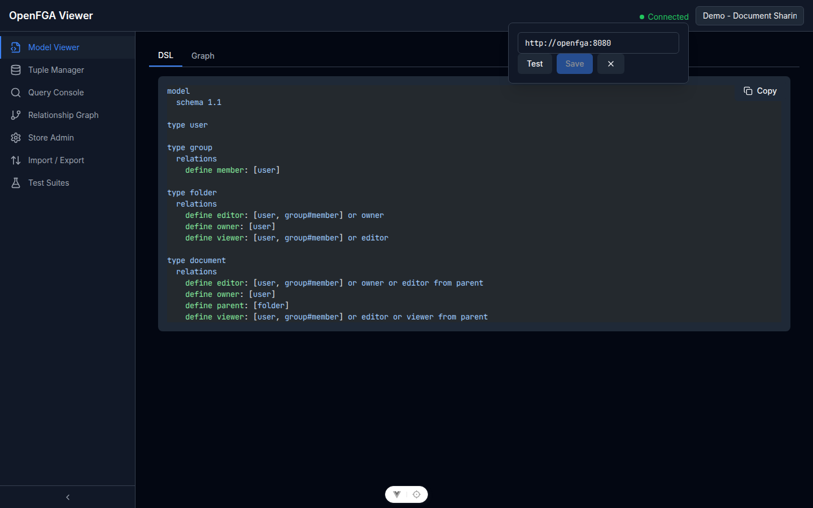

# Per Iniziare

openfga-viewer è uno strumento browser per esplorare e testare i store di autorizzazione [OpenFGA](https://openfga.dev). Si connette a qualsiasi istanza OpenFGA e permette di ispezionare modelli, gestire tuple di relazione, eseguire query sui permessi e creare suite di test automatizzate.

## Prerequisiti

- **Node.js** 18 o superiore
- **npm** 9 o superiore
- Un'istanza **OpenFGA** in esecuzione (locale o remota)
  - Avvio rapido: `docker run -p 8080:8080 openfga/openfga run`

## Installazione

```bash
git clone https://github.com/your-org/openfga-viewer
cd openfga-viewer
npm install
```

## Avviare l'App

```bash
# In due terminali separati:

# Backend (porta 3000)
cd backend && npm run dev

# Frontend (porta 5173)
cd frontend && npm run dev
```

Apri [http://localhost:5173](http://localhost:5173) nel browser.

## Prima Connessione

Clicca sul **badge di connessione** nell'header in alto a destra per aprire il popover di connessione. Clicca **Edit Connection**, poi:

1. Inserisci l'URL di OpenFGA (es. `http://localhost:8080`)
2. Clicca **Test** — una spunta verde conferma che l'URL è raggiungibile
3. Clicca **Save**



Una volta connessa, usa il dropdown di selezione store nell'header per scegliere uno store (o creane uno in **Store Admin** se l'istanza non ne ha).

## Caricare il Dataset Demo

Un fixture demo è incluso in `demo/demo-document-sharing.json`. Modella un sistema di condivisione documenti con utenti, gruppi, cartelle e documenti.

Per caricarlo:

1. Connettiti alla tua istanza OpenFGA
2. Vai su **Import / Export** nella navigazione
3. Clicca **Importa** e seleziona `demo/demo-document-sharing.json`
4. Il modello e le tuple vengono caricati nello store attivo

Questo dataset è usato in tutti gli screenshot della documentazione.

## Avvio con Docker

```bash
docker compose up
```

L'app è disponibile su [http://localhost:5173](http://localhost:5173) con il backend sulla porta 3000 (stesse porte del setup dev bare-host). Un ambiente E2E isolato è definito in `docker-compose.e2e.yml` e usa le porte 5174 / 3001.

## Passi Successivi

- [Connessione e Store](02-connessione-e-store.md) — gestire più store OpenFGA
- [Modello, Tuple e Query](03-modello-tuple-query.md) — esplorare i dati di autorizzazione
- [Suite di Test](06-suite-di-test.md) — automatizzare la verifica dei permessi
