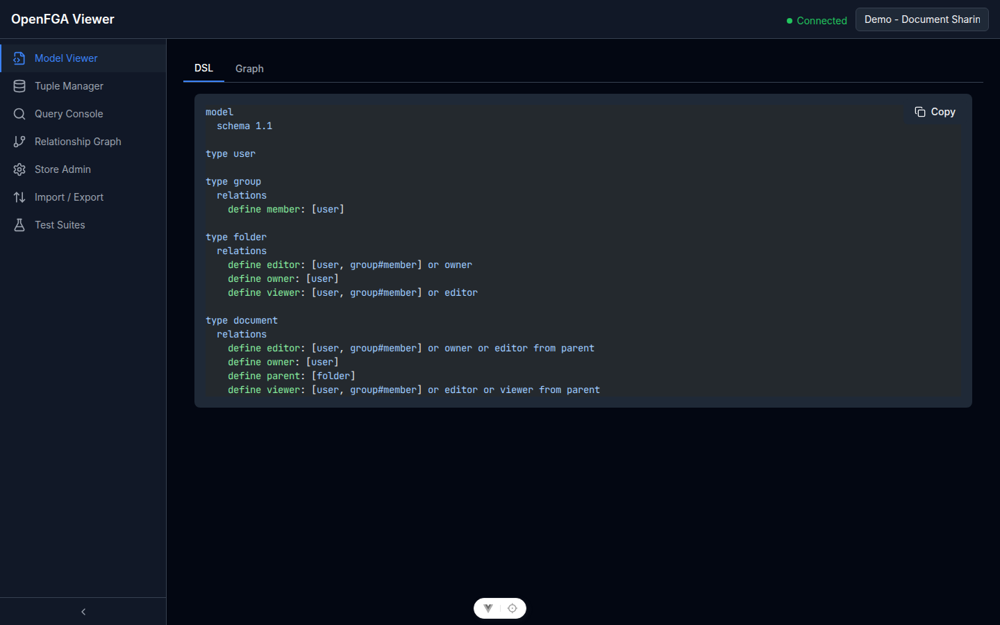
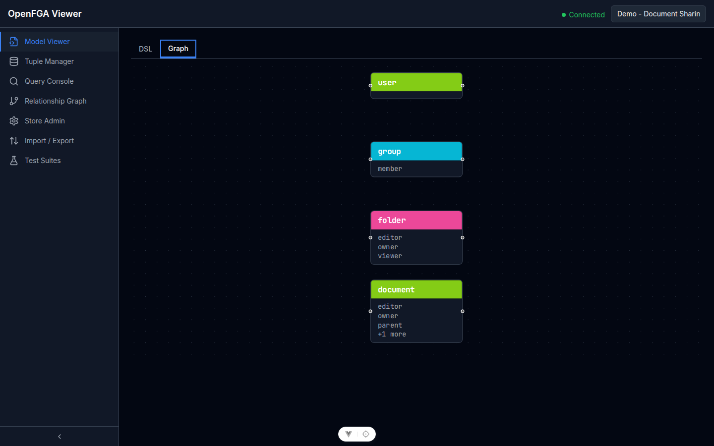
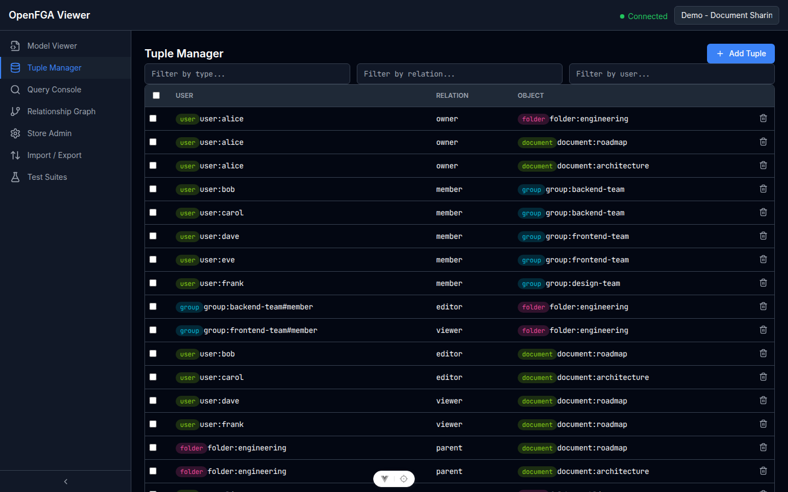
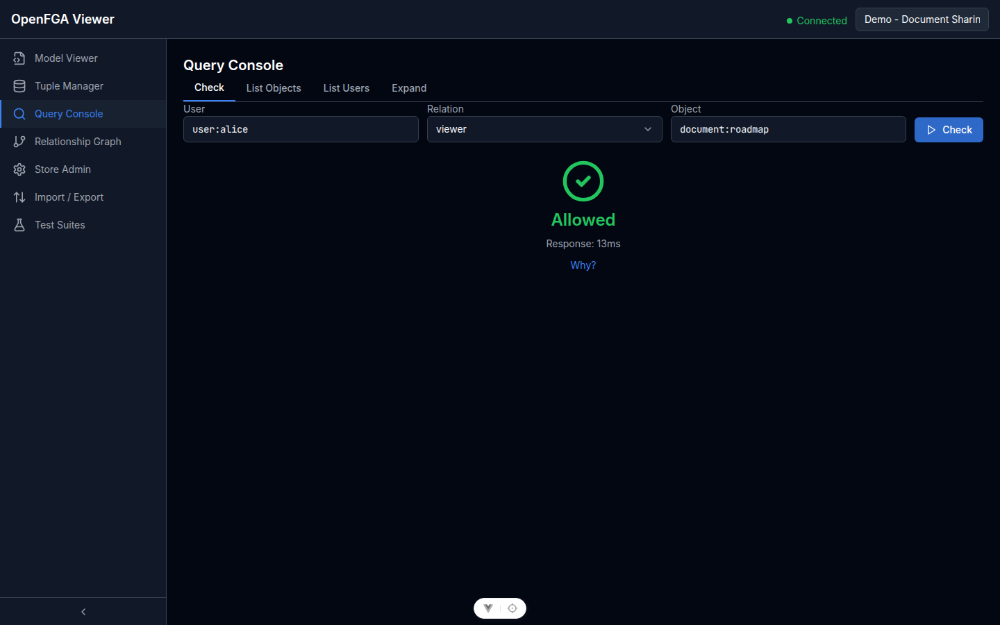
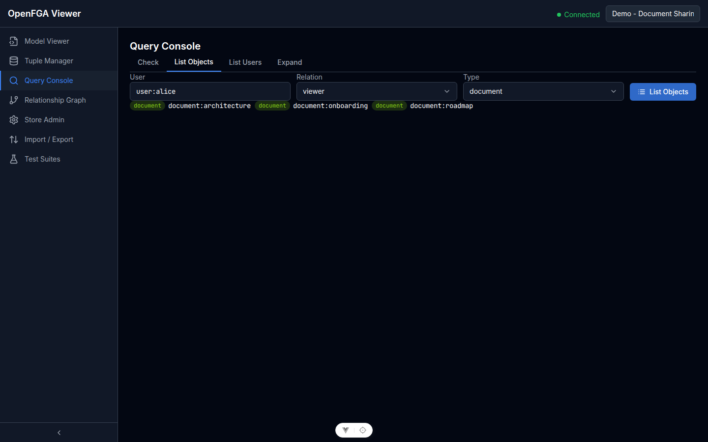
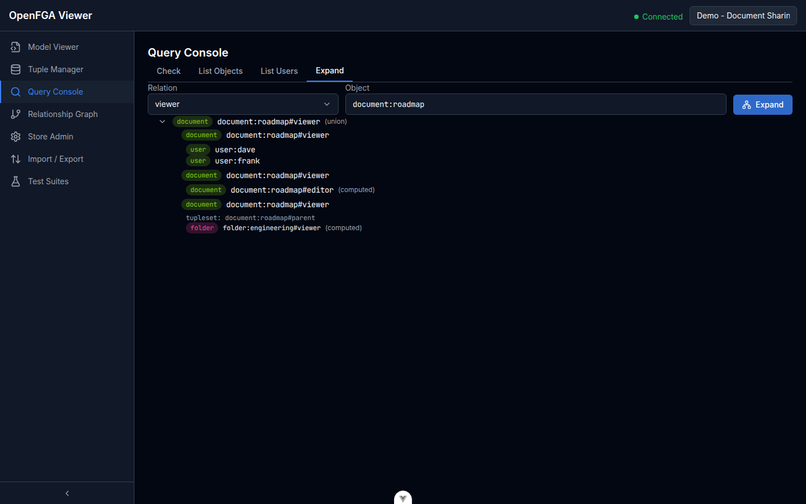

# Modello, Tuple e Query

Queste tre viste sono il nucleo delle capacità di esplorazione di openfga-viewer. Corrispondono direttamente ai tre concetti fondamentali di OpenFGA: il modello di autorizzazione, le tuple di relazione e le query sui permessi.

## Visualizzatore del Modello

Vai su **Model Viewer** nella barra laterale.

### Vista DSL

La vista DSL mostra il modello di autorizzazione dello store attivo nel linguaggio specifico di dominio di OpenFGA.

L'evidenziazione della sintassi rende facile leggere le definizioni dei tipi, le relazioni e gli usersets calcolati. Il DSL è in sola lettura in questa vista.

Nel modello demo, troverai quattro tipi: `user`, `group`, `folder` e `document`. Il tipo `document` eredita l'accesso viewer/editor dalla `folder` padre tramite `tupleToUserset`.

### Vista Grafo

Clicca la tab **Grafo** per vedere il modello come diagramma di nodi interattivo.

Ogni tipo è un nodo. Le frecce rappresentano le relazioni e le loro regole di derivazione (diretta, computed userset, tuple-to-userset). Clicca su un nodo per evidenziarne le connessioni. Scorri o pinch per zoomare; trascina per spostarti.

---

## Gestore delle Tuple

Vai su **Tuple Manager** per navigare e modificare le tuple di relazione.

### Navigare le Tuple

Le tuple sono visualizzate in una tabella paginata con tre colonne: **User**, **Relation**, **Object**. Usa i filtri in alto per cercare per qualsiasi campo.

### Aggiungere una Tupla

1. Clicca **Aggiungi Tupla**
2. Compila i campi **User**, **Relation** e **Object** (con autocomplete dal modello attivo)
3. Clicca **Salva**

Esempio: `user:frank` — `viewer` — `document:architecture`

### Eliminare una Tupla

Clicca l'icona **elimina** su qualsiasi riga. Un dialogo di conferma previene eliminazioni accidentali.

> **Attenzione:** Eliminare una tupla la rimuove immediatamente dallo store OpenFGA. Questo influisce sui controlli dei permessi in tempo reale.

---

## Console delle Query

Vai su **Query Console** per eseguire query sui permessi di OpenFGA contro lo store attivo.

### Check

La tab **Check** risponde alla domanda: *"Questo utente ha questa relazione su questo oggetto?"*

| Campo | Esempio |
|-------|---------|
| User | `user:alice` |
| Relation | `viewer` |
| Object | `document:roadmap` |

Il risultato è mostrato come un grande indicatore verde **Consentito** o rosso **Negato**. Clicca **Perché?** per espandere l'albero di autorizzazione che spiega come è stato derivato il risultato.

### List Objects

La tab **List Objects** risponde alla domanda: *"Su quali oggetti di questo tipo questo utente ha questa relazione?"*

| Campo | Esempio |
|-------|---------|
| User | `user:alice` |
| Relation | `viewer` |
| Type | `document` |

Risultato: una lista di tutti gli oggetti corrispondenti (es. `document:roadmap`, `document:architecture`, `document:onboarding`).

### List Users

La tab **List Users** risponde alla domanda: *"Quali utenti hanno questa relazione su questo oggetto?"*

| Campo | Esempio |
|-------|---------|
| Relation | `editor` |
| Object | `document:roadmap` |

Risultato: una lista di tutti gli utenti con la relazione specificata sull'oggetto, inclusi quelli derivati tramite gruppi.

### Expand

La tab **Expand** mostra l'albero di autorizzazione completo per una relazione su un oggetto.

| Campo | Esempio |
|-------|---------|
| Relation | `viewer` |
| Object | `document:roadmap` |

Risultato: un albero espandibile che mostra ogni utente o gruppo con accesso `viewer`, e tramite quale regola (diretta, computed userset, o tuple-to-userset).
