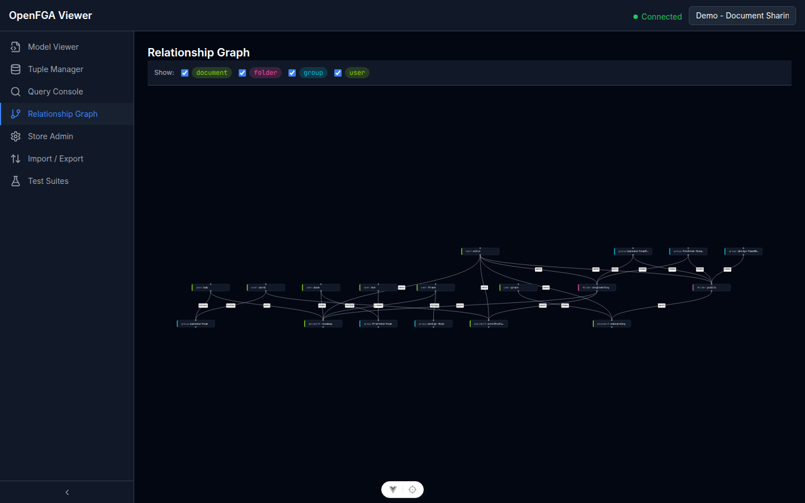

# Grafo delle Relazioni

Il Grafo delle Relazioni fornisce una tela visiva interattiva di tutte le tuple di relazione nello store attivo. A differenza del grafo del Model Viewer (che mostra lo schema di autorizzazione), questa tela mostra **dati reali** — chi è connesso a cosa.

Vai su **Relationship Graph** nella barra laterale.

## Navigare la Tela

| Azione | Come |
|--------|------|
| Spostare | Clicca e trascina sull'area vuota della tela |
| Zoom avanti/indietro | Rotella del mouse o gesto di pinch |
| Adattare tutti i nodi | Clicca il pulsante **Adatta** nella barra degli strumenti |
| Selezionare un nodo | Click singolo |

## Filtraggio

Usa il pannello filtri a sinistra per ridurre i nodi visibili:

- **Filtro tipo:** Mostra solo nodi di tipi specifici (es. solo `document` e `user`)
- **Filtro relazione:** Mostra solo frecce per relazioni specifiche (es. solo frecce `owner`)

I filtri aggiornano il grafo in tempo reale. Reimpostali per mostrare il grafo completo.

## Pannello Inspector

Clicca su qualsiasi nodo per aprire il **Pannello Inspector** a destra. Il pannello mostra:

- Il tipo e l'identificatore del nodo
- Tutte le relazioni **in uscita** (tuple dove questa entità è lo user)
- Tutte le relazioni **in entrata** (tuple dove questa entità è l'object)

Ad esempio, cliccando su `folder:engineering` viene mostrato che `user:alice` è il suo `owner` e `group:backend-team#member` è il suo `editor`.

Il pannello inspector aiuta a tracciare le catene di accesso senza eseguire query individuali.

## Nota sulle Prestazioni

Il grafo carica tutte le tuple nello store attivo. Per store con migliaia di tuple, il render iniziale potrebbe richiedere qualche secondo. Il grafo rimane interattivo durante il caricamento progressivo.
