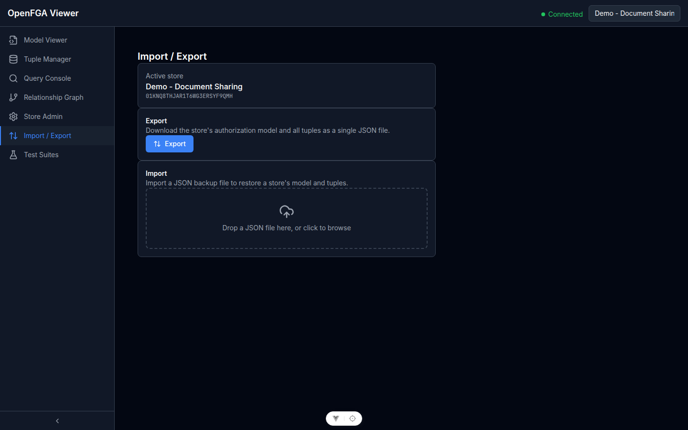

# Import ed Export

Vai su **Import / Export** nella barra laterale.



La funzionalità di import/export permette di salvare e ripristinare lo stato completo di uno store OpenFGA (modello + tuple) come singolo file JSON. È utile per backup, migrazione di dati tra istanze e condivisione di dataset demo.

## Export

Esporta il modello di autorizzazione e tutte le tuple dallo store attivo come file JSON.

1. Clicca **Esporta store**
2. Il browser scarica un file chiamato `<nome-store>-<data>.json`

Il file esportato ha questa struttura:

```json
{
  "storeName": "Il Mio Store",
  "exportedAt": "2026-04-08T12:00:00.000Z",
  "model": { "schema_version": "1.1", "type_definitions": [...] },
  "tuples": [
    { "user": "user:alice", "relation": "owner", "object": "document:roadmap" }
  ]
}
```

Questo formato è identico al fixture demo in `demo/demo-document-sharing.json`.

## Import

Importa un modello e delle tuple da un file JSON nello store attivo. L'import aggiunge dati — non elimina le tuple esistenti né sostituisce il modello a meno che il modello non sia cambiato.

**Importa da file:**
1. Clicca **Importa** (oppure trascina un file nell'area di import)
2. Un'anteprima di validazione mostra i tipi del modello e il numero di tuple trovati nel file
3. Rivedi l'anteprima, poi clicca **Conferma import**

**Gli errori di validazione** vengono mostrati se il file è malformato o il JSON non corrisponde allo schema atteso. Correggi il file e reimporta.

> **Attenzione:** Importare un modello che va in conflitto con le tuple esistenti potrebbe rendere quelle tuple invalide in OpenFGA. Rivedi attentamente le modifiche al modello prima di importare.

## Workflow di Backup e Ripristino

Per fare il backup e ripristinare uno store:

1. **Esporta** dallo store sorgente
2. Connettiti all'istanza target e seleziona (o crea) lo store target
3. **Importa** il file esportato nello store target

Questo workflow funziona tra istanze OpenFGA diverse e versioni diverse, purché la versione dello schema del modello sia compatibile.
