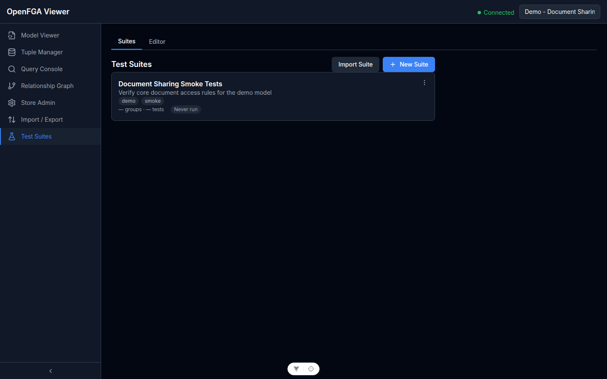

# Suite di Test

Vai su **Test Suites** nella barra laterale.

Le suite di test permettono di definire, salvare ed eseguire controlli automatici sui permessi contro il tuo modello OpenFGA. Ogni suite è una raccolta nominata di test case che verificano le regole di accesso attese.

## Cos'è una Suite di Test?

Una suite di test contiene:

- **Metadati** — nome, descrizione, tag
- **Gruppi** — sezioni logiche che raggruppano test case correlati
- **Test case** — singoli controlli sui permessi, ognuno specificando user, relation, object e risultato atteso (`allowed` o `denied`)
- **Fixture** — override opzionali di modello e tuple caricati in uno store effimero prima di ogni esecuzione

Le suite sono salvate nel database PostgreSQL del viewer e sono indipendenti dall'istanza OpenFGA connessa. La stessa suite può essere eseguita contro istanze diverse.

## Lista delle Suite

La lista delle suite mostra tutte le suite salvate. Ogni card della suite visualizza:

- Nome e descrizione della suite
- Tag
- Stato dell'ultima esecuzione (✅ passata, ❌ fallita, o — se mai eseguita)
- Il numero di gruppi e test case

Clicca una card della suite per aprirla nella tab **Editor**.

## Creare una Suite

1. Clicca **Nuova Suite** (o **Crea la tua prima suite** se la lista è vuota)
2. Inserisci un **Nome** (obbligatorio) e opzionalmente **Descrizione** e **Tag**
3. Clicca **Crea**

La suite viene creata con una definizione vuota e si apre immediatamente nella tab Editor.

## Eliminare una Suite

1. Clicca il menu **⋯** sulla card della suite
2. Clicca **Elimina**
3. Conferma il dialogo — l'eliminazione è permanente

Eliminare una suite la rimuove dal database. Anche i risultati delle esecuzioni associate alla suite vengono eliminati.

## Stato dell'Ultima Esecuzione

La card della suite mostra il risultato dell'esecuzione più recente:

| Badge | Significato |
|-------|-------------|
| ✅ Tutti passati | Ogni test case è passato nell'ultima esecuzione |
| ❌ N falliti | Uno o più test case sono falliti o in errore |
| — | La suite non è mai stata eseguita |

Clicca una card della suite e vai alla tab **Runs** per vedere la cronologia completa delle esecuzioni.
