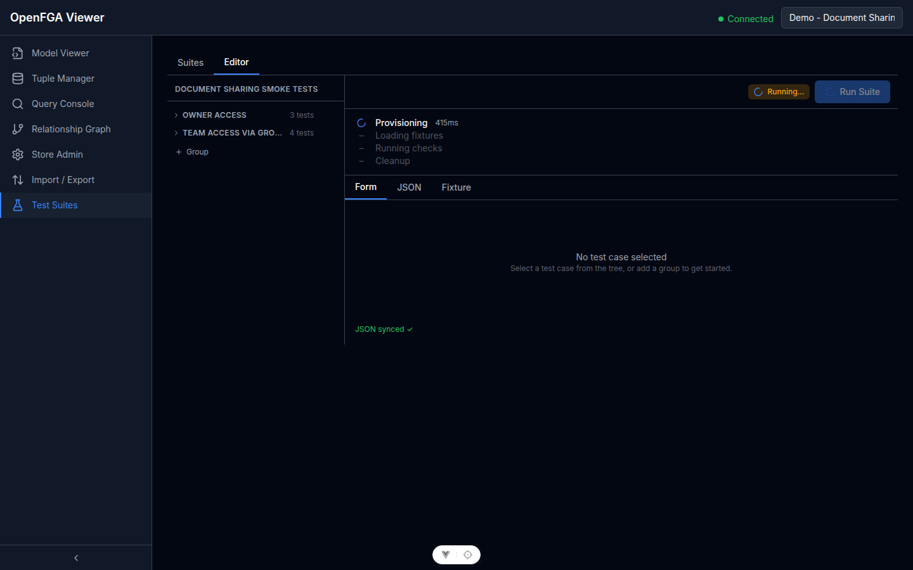
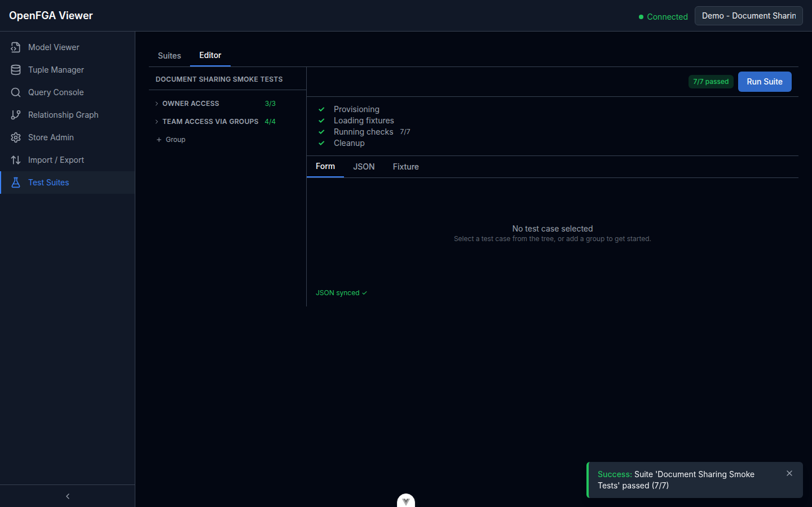

# Esecuzione dei Test

## Avviare un'Esecuzione

Apri una suite dalla lista **Test Suites**. Nell'header dell'editor, clicca il pulsante **Run Suite** per avviare l'esecuzione.

> **Nota:** Il pulsante Run Suite è disabilitato finché la suite non ha una fixture. Una fixture (modello + tuple) è sempre obbligatoria — definisce lo store effimero contro cui viene eseguito ogni test case. Se il pulsante è disabilitato, vai alla tab **Fixture** e definisci o importa una fixture prima.

## Fasi di Esecuzione

Ogni esecuzione attraversa quattro fasi mostrate in una timeline:

| Fase | Descrizione |
|------|-------------|
| **Provisioning** | Viene creato uno store OpenFGA effimero per questa esecuzione |
| **Loading fixtures** | La fixture della suite (modello + tuple) viene caricata nello store effimero |
| **Running checks** | Ogni test case viene eseguito come chiamata `Check` contro lo store effimero |
| **Cleanup** | Lo store effimero viene eliminato, indipendentemente dall'esito |

Il viewer effettua il polling per gli aggiornamenti del run ogni 2 secondi. Se il polling incontra 5 errori consecutivi, si ferma automaticamente e mostra un pulsante **Riprova**.

## Leggere i Risultati

Al termine dell'esecuzione:

L'intestazione mostra un riepilogo: conteggi di **totale**, **passati**, **falliti** ed **in errore**, più la durata totale.

Sotto il riepilogo, ogni test case mostra:

| Colonna | Descrizione |
|---------|-------------|
| Stato | ✅ Passato, ❌ Fallito, ⚠️ Errore |
| Descrizione | L'etichetta del test case |
| User / Relation / Object | I parametri del controllo |
| Atteso | `allowed` o `denied` |
| Effettivo | Il risultato restituito da OpenFGA |
| Durata | Tempo per questo singolo controllo |

**I test case falliti** — dove effettivo ≠ atteso — sono evidenziati in rosso. Indicano che il modello di autorizzazione o i dati della fixture non corrispondono alle regole di accesso previste.

**I test case in errore** — dove il controllo stesso è fallito (es. rete non disponibile, tupla non valida) — vengono mostrati con un'icona di avviso e un messaggio di errore.

## Distinzione: Fallimento del Test vs Errore di Esecuzione

- **Fallimento del test**: Il controllo è andato a buon fine ma il risultato differisce dall'atteso. Significa che la tua politica di autorizzazione non è corretta.
- **Errore di esecuzione**: Il controllo non ha potuto essere eseguito (OpenFGA non raggiungibile, caricamento fixture fallito, modello non valido). Non riflettono la tua policy — risolvi prima il problema di infrastruttura.

## Cronologia delle Esecuzioni

Ogni esecuzione completata viene salvata. Apri una suite e vai alla tab **Runs** per vedere tutte le esecuzioni passate con i relativi timestamp e risultati riepilogativi.

Il risultato dell'esecuzione più recente è mostrato anche sulla card della suite nella lista.
